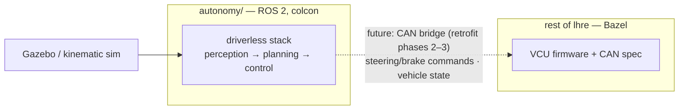
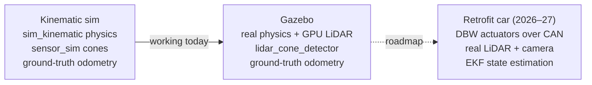

# Autonomy

FSAE driverless stack for Longhorn Racing Electric. The goal: retrofit Orion (the 2025-26 EV) so it drives itself, with a fully autonomous demo by April 2027 (acceleration + skidpad, stretch goal autocross).

**New here? Start with [ros2/GETTING-STARTED.md](ros2/GETTING-STARTED.md).**

## Layout

| Path | What it is |
|------|-----------|
| `ros2/` | The ROS 2 stack. [Setup guide](ros2/GETTING-STARTED.md), [full reference](ros2/README.md) |
| `docs/plans/` | Working docs: plans, change logs, roadmap. Context for contributors and AI agents, not onboarding material |
| `docs/rules/` | FSAE 2026 rules breakdowns relevant to driverless |

## Software lanes

The code is organized so each lane owns whole packages. Lane ownership is tracked in Notion (VMS / Autonomous).

| Lane | Packages | Starter work |
|------|----------|--------------|
| Perception | `lhr_perception` (+ `lhr_sensor_sim` as its sim stand-in) | Autocross reliability: cone duplication during swerves. See [known issues](docs/plans/gazebo-integration.md) |
| State estimation | None yet, this lane starts from scratch | Build the EKF package. The car currently runs on ground-truth odometry from sim |
| Planning & control | `lhr_track_builder`, `lhr_control`, `lhr_mission_manager` | Centerline ordering on tight corners. Unimplemented missions (acceleration, skidpad) |
| Sim & test infra | `lhr_gazebo`, `lhr_sim_kinematic`, `lhr_trackgen`, `lhr_metrics`, `lhr_demo`, `lhr_vehicle`, `scripts/` | Functional tests (none exist yet). CI only builds and lints today |

## How the pieces fit

Where the stack sits in the monorepo — everything else in `lhre` is the
Bazel/firmware world ([ADR-009](../docs/architecture/009-autonomy-outside-bazel.md)):

Today the stack drives only simulators; nothing real is connected yet. The CAN
bridge to the VCU is planned in the
[retrofit roadmap](docs/plans/retrofit-roadmap-2026-27.md).

The road from sim to the retrofit car swaps the layer *under* the same upper
stack at every step (see the
[architecture comparison](ros2/README.md#architecture-comparison)):

## Status (August 2026)

- Full sim pipeline completes laps, both kinematic and Gazebo physics
- LiDAR perception works on the oval track, unreliable on autocross
- Camera work not started
- Retrofit hardware being ordered (details in Notion)
