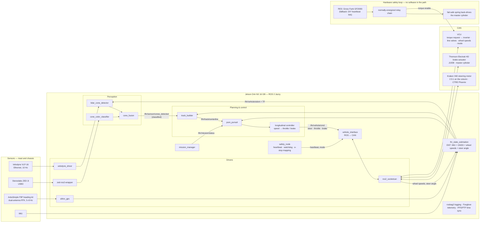

# On-car architecture (target)

The stack as it should look on Orion for the April 2027 demo. Nothing to the
right of the CAN bus exists in software yet; the point of this page is to
have one picture to build toward. Hardware is the 8/2 decided order and the
node names follow the Software Architecture page in Notion — if this page
and Notion disagree, Notion wins.

Solid boxes exist today (ours, or off-the-shelf drivers). Dashed boxes are
not written yet.

## What changes between sim and car

The upper stack — `track_builder`, `pure_pursuit`, `mission_manager` — is
the same code that laps in Gazebo today. Everything under the common topic
interface swaps (see the
[architecture comparison](../../ros2/README.md#architecture-comparison)):

| Sim today | On the car | Owner |
|-----------|------------|-------|
| Gazebo GPU LiDAR / `sensor_sim` cones | VLP-16 through `velodyne_driver`, same `lidar_cone_detector` | Perception |
| No camera; unclassified cones | ZED 2i → `cone_color_classifier` → `cone_fusion`; color-aware Delaunay | Perception |
| Ground-truth `OdometryPublisher` | `lhr_state_estimation` EKF on IMU + RTK GNSS + wheel speeds + steer angle | State estimation |
| `pure_pursuit` publishes a speed; Gazebo sets wheel velocity directly | Longitudinal controller turns speed into throttle and brake (with software brake bias) | Planning & control |
| `joint_cmd_adapter` → Gazebo joints | `vehicle_interface` → CAN: column angle to the steering motor, actuator position to the brake, torque request to the VCU; feedback back in | Sim & test infra + ELC |
| `auto_go` timer | Physical go from the RES; `safety_node` heartbeat that the VCU watchdogs | Lead + ELC |
| `map → base_link` only | `map → odom → base_link` plus sensor frames with measured extrinsics | State estimation |
| `use_sim_time` | PPS from GNSS into the LiDAR, PTP/chrony on the Jetson | Sim & test infra |

Two things deliberately have no software in the loop: the remote emergency
stop and the fail-safe brake. Power loss or a dropped heartbeat de-energizes
the relay chain, which removes torque enable and lets the spring apply the
brakes. `safety_node` maps stack-side faults onto the same chain; it never
replaces it.

## Open decisions this picture depends on

- The CAN message set between the Jetson and the VCU (commands, feedback,
  heartbeat) — to be written as an ADR with ELC before the bench rig.
- Steering command semantics: column angle versus road-wheel angle, and the
  measured rack ratio. `vehicle.yaml` is the home for the numbers.
- Brake command semantics: actuator position versus pressure, and how bias
  is commanded through the line valves.
- Whether the RES is the sponsored GF2000i or the DIY heartbeat link
  (decision by ~November per the hardware page).

Related: [retrofit roadmap](retrofit-roadmap-2026-27.md) (dates),
[camera fusion](camera-fusion.md) (perception detail),
`lhr_vehicle/config/vehicle.yaml` (vehicle numbers; lands with PR #47).
