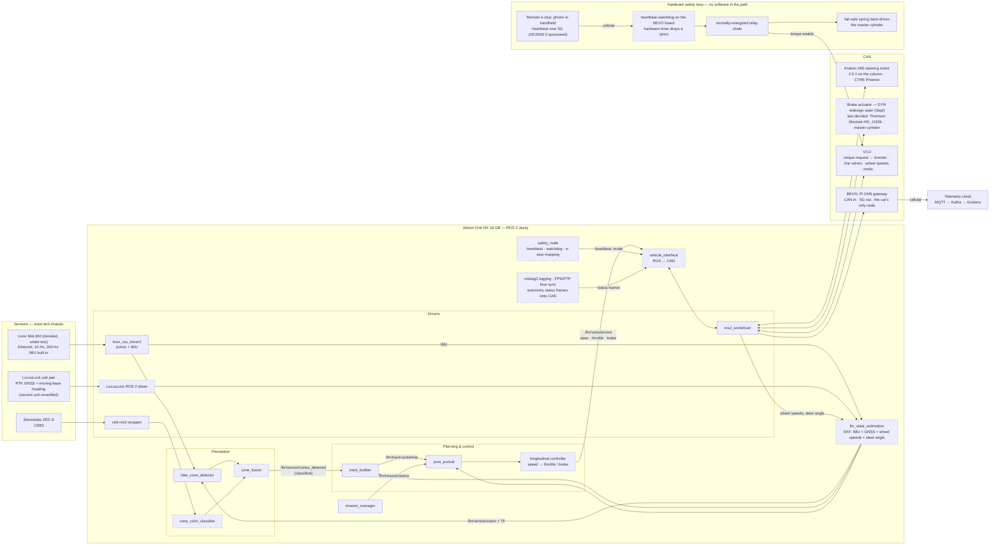

# On-car architecture (target)

The stack as it should look on Orion for the April 2027 demo. Nothing to the
right of the CAN bus exists in software yet; the point of this page is to
have one picture to build toward. Hardware is the 8/2 decided order with the
September changes noted inline (donated LiDAR, DYN reopening the brake, BEVO
as the only radio). Node names follow the Software Architecture page in
Notion — if this page and Notion disagree, Notion wins.

Solid boxes exist today (ours, or off-the-shelf drivers). Dashed boxes are
not written yet.

## What changes between sim and car

The upper stack — `track_builder`, `pure_pursuit`, `mission_manager` — is
the same code that laps in Gazebo today. Everything under the common topic
interface swaps (see the
[architecture comparison](../../ros2/README.md#architecture-comparison)):

| Sim today | On the car | Owner |
|-----------|------------|-------|
| Gazebo GPU LiDAR (VLP-16 model) / `sensor_sim` cones | Livox Mid-360 through `livox_ros_driver2`, same `lidar_cone_detector`. The Gazebo sensor stays a VLP-16 until someone models the Mid-360's rosette in `gpu_lidar` | Perception (car), Sim & test infra (model) |
| No camera; unclassified cones | ZED 2i → `cone_color_classifier` → `cone_fusion`; color-aware Delaunay | Perception |
| Ground-truth `OdometryPublisher` | `lhr_state_estimation` EKF on the Mid-360 IMU (ZED IMU as backup) + LocusLock RTK position + wheel speeds + steer angle. Moving-base heading only if the second LocusLock unit works; otherwise the EKF derives heading from GNSS velocity and the IMU | State estimation |
| `pure_pursuit` publishes a speed; Gazebo sets wheel velocity directly | Longitudinal controller turns speed into throttle and brake (with software brake bias) | Planning & control |
| `joint_cmd_adapter` → Gazebo joints | `vehicle_interface` → CAN: column angle to the steering motor, a brake command whose semantics wait on the DYN redesign, torque request to the VCU; feedback back in | Sim & test infra + ELC |
| `auto_go` timer | An explicit go command from the pit device over the same link as the heartbeat. Heartbeat presence is liveness only and never grants go. `safety_node` heartbeat that the VCU watchdogs | Lead + ELC |
| RViz and PlotJuggler on the dev box | BEVO relays autonomy status frames from CAN over 5G to the existing telemetry stack; point clouds stay in rosbag on the Jetson; RViz only over Ethernet with the car parked. There is no WiFi on the car | Telemetry + Sim & test infra |
| `map → base_link` only | `map → odom → base_link` plus sensor frames with measured extrinsics | State estimation |
| `use_sim_time` | PPS from GNSS into the LiDAR, PTP/chrony on the Jetson | Sim & test infra |

Two things deliberately have no software in the loop: the remote emergency
stop and the fail-safe brake. There are two heartbeats, and each ends in
hardware:

- **Remote.** The pit crew's phone or handheld sends a heartbeat over 5G to
  BEVO, because that is the only radio on the car. A hardware timer on the
  BEVO board toggles a GPIO while heartbeats arrive and drops it when they
  stop; that GPIO sits in the normally-energized relay chain. The Pi's
  software can keep the chain alive and can never hold it open: a crashed
  daemon, a frozen kernel, a dead modem, or a lost cell all read as "brakes
  on". Only authenticated, fresh heartbeats count: each carries a sequence
  number and a MAC under a key shared with the pit device, and the validator
  on BEVO drops anything unsigned, stale, or replayed before it can touch the
  GPIO, so a replayed packet cannot hold the chain closed. The timeout comes
  from measured link-gap statistics, not a guess; BEVO already streams, so
  log heartbeat gaps at the test site first.
- **Jetson.** `safety_node` publishes a heartbeat on CAN and the VCU
  watchdogs it, dropping torque enable when it stops. `safety_node` maps
  stack-side faults onto the same chain; it never replaces it.

Three signals, in priority order. The relay chain is hardware and wins over
everything. The remote heartbeat is liveness: its absence stops the car, its
presence permits nothing. Go is an explicit command from the pit device;
`mission_manager` moves READY → DRIVING only with go received and both
heartbeats alive, and the `mode` that `safety_node` sends to
`vehicle_interface` is that enable state, so a lost heartbeat clears it.

Power loss or a de-energized chain removes torque enable and lets the spring
apply the brakes.

## Open decisions this picture depends on

- The CAN message set between the Jetson and the VCU (commands, feedback,
  heartbeat) and the autonomy status frames BEVO relays — to be written as
  an ADR with ELC before the bench rig.
- Whether the donated Mid-360 passes its acceptance test (LiDAR Test Plan
  in the Notion wiki). If not, a used VLP-16 through `velodyne_driver`, which
  is what the sim already models.
- Brake actuation: DYN (Jack, with Abishek) reopened the design in
  September. The Electrak HD, line valves, and fail-safe spring are the last
  decided state until DYN publishes the new one; the actuator-position
  versus pressure question and line-valve bias commanding move with it.
- Steering command semantics: column angle versus road-wheel angle, and the
  measured rack ratio. `vehicle.yaml` is the home for the numbers.
- The remote e-stop is the 5G heartbeat unless the GF2000i sponsorship
  lands. Telemetry owns the heartbeat validator, the key handling, and the
  sequence state on BEVO; ELC owns the hardware timer and the GPIO into the
  relay chain; the timeout needs measured link data.
- The LocusLock integration: ROS 2 driver, output rate, whether the pair
  gives heading directly (moving-base) or the EKF derives it, and whether
  the second unit works at all after ELC looks at it.

Related: [retrofit roadmap](retrofit-roadmap-2026-27.md) (dates),
[camera fusion](camera-fusion.md) (perception detail),
[`lhr_vehicle`](../../ros2/src/lhr_vehicle/README.md) (vehicle numbers).
