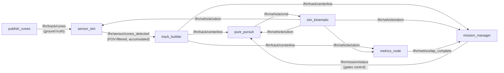
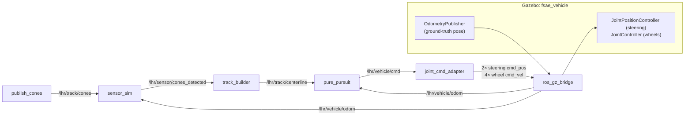
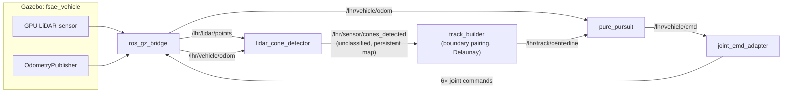
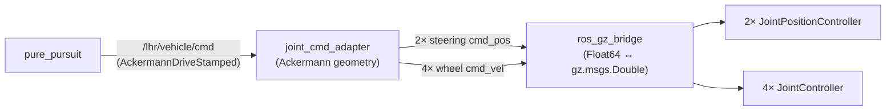
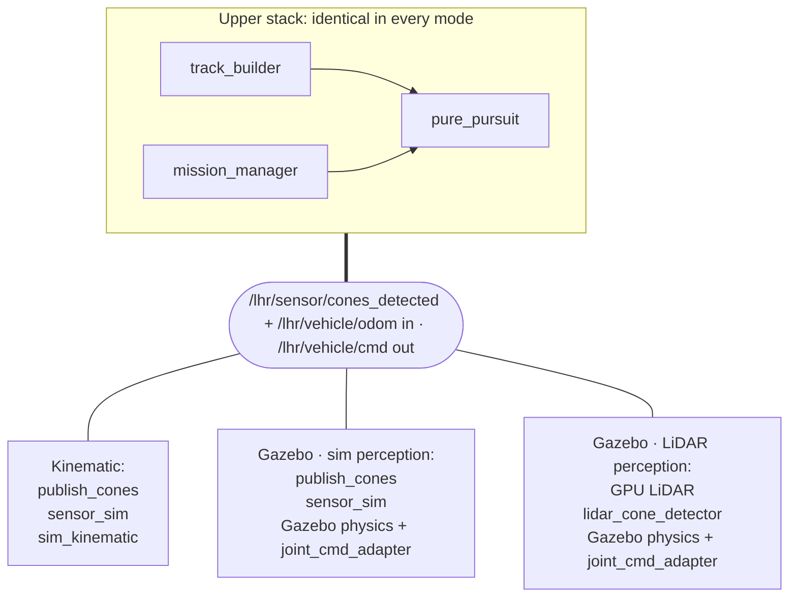
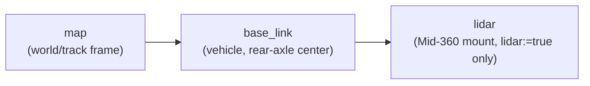
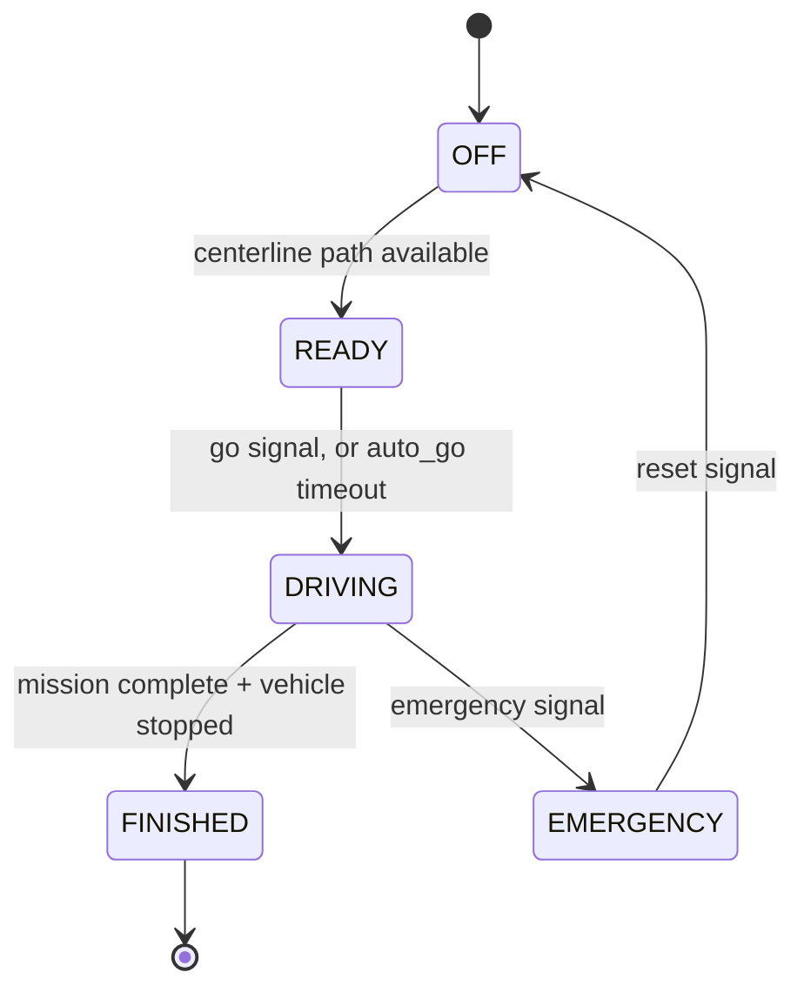
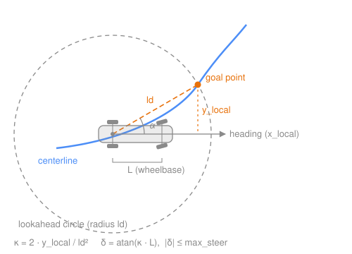

# Autonomy: ROS 2 Workspace

Colcon workspace for LHR driverless / autonomy nodes. This file is the **reference**: packages, data flow, topics, parameters.

**New here?** Follow [GETTING-STARTED.md](GETTING-STARTED.md) first.

**Supported platform:** Ubuntu 24.04 (native only, no WSL) + **ROS 2 Jazzy**

## Packages

| Package | Description |
|---------|-------------|
| `lhr_trackgen` | Publishes a synthetic cone track (`/lhr/track/cones`) and cone IDs (left: 0..N-1, right: 10000..10000+N-1) |
| `lhr_sensor_sim` | FOV-limited sensor simulation: filters cones by vehicle pose, accumulates detections |
| `lhr_track_builder` | Subscribes to cones, pairs left/right by ID, publishes centerline path (`/lhr/track/centerline`) |
| `lhr_sim_kinematic` | Kinematic bicycle-model vehicle simulator (lightweight, no Gazebo needed) |
| `lhr_control` | Pure pursuit path-following controller with curvature-adaptive lookahead and speed planning |
| `lhr_mission_manager` | FSAE driverless state machine (Off → Ready → Driving → Finished → Emergency) |
| `lhr_metrics` | Cross-track error, off-track count, and lap detection (CSV output) |
| `lhr_gazebo` | Gazebo Harmonic physics simulation: vehicle with direct joint control, ground-truth odometry, LiDAR sensor, RViz integration |
| `lhr_perception` | LiDAR-based cone detection: pointcloud clustering, persistent mapping (unclassified cones, no left/right split). Functional on oval track; path quality needs tuning on complex tracks. |
| `lhr_demo` | Launch file that starts the full kinematic stack in one command |
| `lhr_vehicle` | Orion's physical parameters (`config/vehicle.yaml`) and their loader, the single source for wheelbase, track, steering limits, masses and sensor mounts. See [its README](src/lhr_vehicle/README.md) |

## Data flow

### Kinematic sim (run_demo.sh)



`sensor_sim` needs odometry to place the FOV; `mission_manager` watches the
centerline to leave `OFF`. Viz-only topics (`/lhr/sensor/cones_viz`,
`/lhr/sensor/fov_viz`, `/lhr/track/centerline_markers`, `/lhr/control/lookahead`)
and `/lhr/debug/*` are omitted. Full list under [Topics](#topics).

### Gazebo sim (run_gazebo_demo.sh)

**Sim perception (default, `perception:=sim`):**


`mission_manager` and `metrics_node` subscribe exactly as in the kinematic
diagram (omitted here). The IMU is bridged to `/lhr/imu/data` but nothing
consumes it yet. It is there for future state estimation.

**LiDAR perception (`perception:=lidar`):**


The upper stack (track_builder, control, mission_manager, metrics) is identical in both modes. The `perception` launch argument selects between the sim pipeline and LiDAR-based detection.

To bypass the sensor sim and use all cones directly (god-mode), override the cone topic:
```bash
ros2 run lhr_track_builder track_builder --ros-args -p cone_topic:=/lhr/track/cones
```

## Prerequisites

Machine setup lives in [GETTING-STARTED.md](GETTING-STARTED.md): Ubuntu 24.04 native + ROS 2 Jazzy + Gazebo Harmonic. No WSL.

## Quick start

```bash
# Build once
./scripts/build.sh

# Terminal 1: start the full stack
./scripts/run_demo.sh

# Terminal 2: open RViz (pre-configured displays + fixed frame = map)
./scripts/rviz_demo.sh

# Terminal 3 (optional): open PlotJuggler for debug signals
./scripts/run_plotjuggler.sh
```

In PlotJuggler: click **Streaming** → **ROS2 Topic Subscriber** → **Start**, select topics, then drag them onto the plot area. Useful topics: `/lhr/debug/curvature`, `/lhr/debug/v_cmd`, `/lhr/debug/mission_state`, `/lhr/vehicle/cmd`.

Launch arguments can be passed through `run_demo.sh`:

```bash
./scripts/run_demo.sh lookahead_dist:=6.0 seed:=42

# Disable metrics collection:
./scripts/run_demo.sh enable_metrics:=false

# Manual go signal (don't auto-start driving):
./scripts/run_demo.sh auto_go:=false
# Then in another terminal:
ros2 topic pub --once /lhr/mission/go std_msgs/msg/Bool "{data: true}"
```

## Tests and CI

```bash
colcon test                     # from ros2/, after a build
colcon test-result --verbose    # prints the failures
```

Only the ament linters run today (`ament_flake8` and `ament_pep257`, one
`test/` dir per package); functional tests are open work for the Sim & test
infra lane.

CI runs the same build and test
([`.github/workflows/autonomy.yml`](https://github.com/LonghornRacingElectric/lhre/blob/main/.github/workflows/autonomy.yml))
on the `ros:jazzy-ros-base` image for every PR that touches `autonomy/`.
Dependencies are installed from each package's `package.xml` with `rosdep`,
so declare new ones there. Gazebo (`ros_gz_*`) is skipped in CI since
nothing there launches a simulator.

The ament linters are stricter than plain flake8. What trips people up:

- Single quotes for strings (`Q000`).
- Google import order (`I100`, `I101`): within a group, `import x` and
  `from x import y` lines interleave alphabetically by module name, and
  names inside a `from` import are sorted. ROS packages, numpy and scipy
  are all one third-party group.
- Multi-line docstrings put the summary on the line after the opening
  quotes (`D213`, the ROS 2 house style). Single-line docstrings stay on
  one line.
- Summary lines end with a period and start with an imperative verb
  (`D400`, `D401`); no blank line after a function docstring (`D202`).
  Max line length 99.

## Scripts reference

All scripts live in `scripts/` and should be run from the `autonomy/ros2` directory.

| Script | Description |
|--------|-------------|
| `build.sh` | Builds all packages with `colcon build --symlink-install`. Run after any code change. |
| `run_demo.sh` | Launches the full kinematic stack (cones + centerline + sim + control + mission manager + metrics) via `ros2 launch`. Accepts launch args, e.g. `./scripts/run_demo.sh seed:=42`. |
| `rviz_demo.sh` | Opens RViz with the pre-configured `rviz/default.rviz` config (all displays + fixed frame already set). |
| `run_cones.sh` | Runs only the cone publisher (`lhr_trackgen`). |
| `run_centerline.sh` | Runs only the centerline builder (`lhr_track_builder`). |
| `run_sim.sh` | Runs only the kinematic vehicle simulator (`lhr_sim_kinematic`). |
| `run_control.sh` | Runs only the pure pursuit controller (`lhr_control`). |
| `run_sensor.sh` | Runs only the sensor simulation (`lhr_sensor_sim`). |
| `run_metrics.sh` | Runs only the metrics node (`lhr_metrics`). Prints summary on Ctrl+C and appends to `data/metrics.csv`. |
| `run_plotjuggler.sh` | Opens PlotJuggler for plotting debug signals (curvature, speed, steering). |
| `run_headless.sh` | Runs the kinematic stack with no display and exits non-zero unless the run finished cleanly. The entry point for any gate. |
| `check_stability.sh` | Repeats one run `RUNS` times at one `SEED` and fails if the gated metrics drift outside their per-metric bands. Answers whether the gate is trustworthy before you trust a result from it. |
| `check_layout.sh` | Checks the committed Foxglove layout against a recorded bag and fails if it names a topic or frame the bag lacks. A renamed topic otherwise shows up as empty panels, which reads as a broken sim. |
| `generate_gazebo_world.sh` | Generates a Gazebo world SDF from the track generator. Accepts `--seed`, `--style`, `--num-waypoints`, etc. |
| `run_gazebo_demo.sh` | Launches the Gazebo-based stack (physics sim + adapters + upper stack). Accepts same args as `run_demo.sh`. |
| `src/lhr_gazebo/scripts/generate_vehicle_model.py` | Regenerates the Gazebo vehicle `model.sdf` from `lhr_vehicle/config/vehicle.yaml`. Run after editing the YAML; commit both. |

The individual `run_*.sh` scripts are useful for debugging a single node. For normal use, prefer the two-terminal workflow (`run_demo.sh` + `rviz_demo.sh`).

## Gazebo simulation

The `lhr_gazebo` package provides an alternative simulation backend using Gazebo physics. It replaces the kinematic bicycle model (`lhr_sim_kinematic`) with a full physics vehicle in Gazebo while the cone detection pipeline and upper stack remain unchanged.

### Setup

1. Install Gazebo (see prerequisites above)
2. Build: `./scripts/build.sh`
3. Generate a world file from the track generator:
   ```bash
   ./scripts/generate_gazebo_world.sh --seed 1
   ```

### Running

```bash
# Single command: launches Gazebo + RViz + full autonomy stack
./scripts/run_gazebo_demo.sh
```

RViz launches automatically alongside Gazebo (disable with `rviz:=false`). The RViz config shows centerline, cones, odometry trail, lookahead point, and FOV visualization.

Launch arguments work the same way:
```bash
./scripts/run_gazebo_demo.sh seed:=42 lookahead_dist:=6.0
./scripts/run_gazebo_demo.sh gui:=false          # headless Gazebo (no Gazebo GUI)
./scripts/run_gazebo_demo.sh rviz:=false         # disable RViz
./scripts/run_gazebo_demo.sh perception:=lidar   # LiDAR-based cone detection
./scripts/run_gazebo_demo.sh track_style:=oval   # oval track (also: autocross, simple)
./scripts/run_gazebo_demo.sh track_style:=oval perception:=lidar  # LiDAR on oval (best LiDAR experience)
```

The `track_style` argument selects the track generator (`oval`, `autocross`, or `simple`). The world SDF is auto-resolved from `track_style` + `seed` (e.g. `oval_seed1.sdf`). Pre-generated worlds are installed by colcon from `worlds/*.sdf`.

**Launch file architecture:** `gazebo_demo.launch.py` uses `OpaqueFunction` instead of `IfCondition`/`UnlessCondition` for perception mode and world selection. All launch args are declared in `generate_launch_description()`, and nodes are built in the `_launch_setup()` callback which runs at launch time with access to resolved argument values.

### Vehicle model

The FSAE vehicle (`models/fsae_vehicle/model.sdf`) uses STL meshes (`meshes/carBody.stl`, `meshes/carTire.stl`) for visuals with simplified collision geometry. **`model.sdf` is generated**: `scripts/generate_vehicle_model.py` renders `templates/model.sdf.in` from [`lhr_vehicle/config/vehicle.yaml`](src/lhr_vehicle/README.md), so the numbers below are Orion's and shared with the controller, the kinematic sim and perception:

| Parameter | Value | Source |
|-----------|-------|--------|
| Wheelbase | 1.5494 m | BobSim |
| Track width | 1.2122 m | BobSim |
| Wheel radius | 0.2045 m | BobSim |
| Chassis mass | 160.6 kg (no driver) | BobSim |
| Wheel mass | 8.5 kg each | BobSim |
| Steering limit | ±0.55 rad (~31.5 deg) | assumed until measured |
| Reference point | Rear axle center at ground level | n/a |

Edit `vehicle.yaml`, rerun the generator, and commit both files together; `generate_vehicle_model.py --check` (and `lhr_gazebo`'s tests) fail when they disagree.

### Joint control architecture

The vehicle does **not** use Gazebo's built-in `AckermannSteering` plugin (which is too sluggish due to physics solver latency). Instead, it uses direct joint controllers for near-instant response:

| Joint | Plugin | Control Mode | Topic |
|-------|--------|-------------|-------|
| `front_left_steering_joint` | `JointPositionController` | Position (velocity commands, no PID) | `.../cmd_pos` |
| `front_right_steering_joint` | `JointPositionController` | Position (velocity commands, no PID) | `.../cmd_pos` |
| `front_left_wheel_joint` | `JointController` | Velocity (direct) | `.../cmd_vel` |
| `front_right_wheel_joint` | `JointController` | Velocity (direct) | `.../cmd_vel` |
| `rear_left_wheel_joint` | `JointController` | Velocity (direct) | `.../cmd_vel` |
| `rear_right_wheel_joint` | `JointController` | Velocity (direct) | `.../cmd_vel` |

The `joint_cmd_adapter` ROS2 node converts `AckermannDriveStamped` commands into 6 individual joint commands:
- **Steering angles** use proper Ackermann geometry (inner wheel turns more than outer)
- **Wheel velocities** account for differential turn radii at each wheel
- All commands are bridged to Gazebo via `ros_gz_bridge` as `Float64` ↔ `gz.msgs.Double`



Odometry comes from Gazebo's `OdometryPublisher` system plugin, which reports the vehicle's world-frame pose directly (not wheel encoder integration).

### Architecture comparison



| Component | Kinematic | Gazebo (`perception:=sim`) | Gazebo (`perception:=lidar`) |
|-----------|-----------|----------------------------|------------------------------|
| Cone source | `publish_cones` | `publish_cones` (reused) | Gazebo GPU LiDAR |
| Perception | `sensor_sim` (FOV filter) | `sensor_sim` (reused) | `lidar_cone_detector` (pointcloud clustering) |
| Physics / vehicle | `sim_kinematic` | Gazebo | Gazebo |
| `track_builder` pairing | index | index | boundary (Delaunay) |
| Actuation | `/lhr/vehicle/cmd` directly | `joint_cmd_adapter` → 6 joints | `joint_cmd_adapter` → 6 joints |

All paths produce identical ROS 2 topic interfaces. The upper stack doesn't know the difference.

### World generation

The world generator script (`lhr_gazebo/scripts/generate_world.py`) creates a Gazebo world SDF from `lhr_trackgen` output:
- Accepts `--style` flag to select the track generator: `autocross` (default), `simple`, or `oval`
- Procedural cone placement from Catmull-Rom splines (same geometry as kinematic sim)
- Vehicle spawn position auto-computed on the straightest section of track (avoids loop closure area)
- ODE physics engine at 1 kHz (0.001 s step), real-time factor 1.0
- Ground plane: 200 x 200 m
- Pre-generated worlds (e.g. `worlds/oval_seed1.sdf`) are installed by colcon via `setup.py` `data_files`

### Gazebo-ROS bridge

The bridge config (`config/ros_gz_bridge.yaml`) maps 11 topics:

| Direction | ROS 2 Topic | Gazebo Topic | Type |
|-----------|-------------|--------------|------|
| GZ → ROS | `/lhr/vehicle/odom` | `/model/fsae_vehicle/odometry` | Odometry |
| GZ → ROS | `/tf` | `/model/fsae_vehicle/tf` | TFMessage |
| GZ → ROS | `/clock` | `/clock` | Clock |
| GZ → ROS | `/lhr/imu/data` | `/imu/data` | Imu |
| GZ → ROS | `/lhr/lidar/points` | `/lidar/points` | PointCloud2 |
| ROS → GZ | 2x steering `cmd_pos` | (same) | Float64/Double |
| ROS → GZ | 4x wheel `cmd_vel` | (same) | Float64/Double |

## Recording and viewing runs

A run can record itself to MCAP, and a recorded run opens in Foxglove
with no ROS install involved.

```bash
ros2 launch lhr_demo mvs_demo.launch.py record:=true    # writes data/bags/<run_id>
ros2 launch lhr_demo mvs_demo.launch.py foxglove:=true  # live, ws://localhost:8765
```

MCAP is the default rosbag2 storage in Jazzy, so recording needs nothing
installed. The live bridge needs `ros-jazzy-foxglove-bridge`, declared in
`lhr_demo`'s `package.xml` so `rosdep install` provides it.

The bag lands under the same `run_id` the metrics row carries, so a row
reporting a bad number names the recording that explains it, and the bag
itself carries `run_id`, `git_sha`, `scenario` and `seed` as rosbag2
`custom_data`. Recording is off by default: a lap is roughly 6 MiB and
the gate runs many seeds.

Load [`foxglove/lhr_sim.json`](https://github.com/LonghornRacingElectric/lhre/blob/main/autonomy/ros2/foxglove/lhr_sim.json)
as the layout so everyone is looking at the same panels: a 3D view of
the track and cloud, command against actual speed, steering, and
mission state.

Its structure is checked against a real Foxglove export, and
`./scripts/check_layout.sh <bag>` confirms every topic and frame it
names is present. What is still unconfirmed is how the app *renders*
it, since that cannot be tested from here. If a panel comes up empty
after `check_layout.sh` passes, the layout is at fault rather than the
data: fix it in the app and re-export over the file.

Which topics get recorded, why the list is explicit rather than `--all`,
and the YAML trap in `run_id` are all in
[lhr_demo/README.md](src/lhr_demo/README.md).

## Simulation clock

Both stacks run on simulated time. Gazebo publishes `/clock` through the
bridge; in the kinematic stack `lhr_sim_kinematic` does it, because that
node is the plant and already integrates a fixed `dt`. Publishing that step
as `/clock` makes every other node advance in exact increments instead of
drifting with host load.

`mvs_demo.launch.py` takes `use_sim_time` (default `true`), which sets
`use_sim_time` on every node and `publish_clock` on the simulator. The
simulator itself stays on wall time and paces the run: a clock source that
waited on its own clock would never tick.

What this buys, measured over repeat runs of one seed: the spread in
`mean_cte` fell from 1.08% to 0.31%. What it does not buy is bit-identical
runs. Each node is its own process with its own executor, so which odom
sample a controller sees before its next timer fires is still up to the OS
scheduler. Repeat runs land within about 0.5%, and `max_cte` is
reproducible exactly. Gate on a tolerance band, not on equality.

## Topics

| Topic | Type | Description |
|-------|------|-------------|
| `/lhr/track/cones` | `visualization_msgs/MarkerArray` | Blue (left) and yellow (right) cone markers (ground truth) |
| `/lhr/sensor/cones_detected` | `visualization_msgs/MarkerArray` | Cones detected by sensor sim (accumulated, FOV-filtered) |
| `/lhr/sensor/cones_viz` | `visualization_msgs/MarkerArray` | All cones: detected = bright, unseen = dim/transparent |
| `/lhr/sensor/fov_viz` | `visualization_msgs/MarkerArray` | Sensor FOV frustum visualization |
| `/lhr/track/centerline` | `nav_msgs/Path` | Ordered centerline path through midpoints |
| `/lhr/track/centerline_markers` | `visualization_msgs/MarkerArray` | Debug: green spheres + line strip |
| `/lhr/vehicle/cmd` | `ackermann_msgs/AckermannDriveStamped` | Steering + speed command |
| `/lhr/vehicle/odom` | `nav_msgs/Odometry` | Vehicle pose and twist |
| `/lhr/control/lookahead` | `visualization_msgs/Marker` | Debug: lookahead target point |
| `/lhr/mission/status` | `std_msgs/String` | Driverless system status (`OFF`, `READY`, `DRIVING`, `FINISHED`, `EMERGENCY`) |
| `/lhr/mission/go` | `std_msgs/Bool` | Go signal, triggers Ready → Driving transition |
| `/lhr/mission/emergency` | `std_msgs/Bool` | Emergency stop, triggers Driving → Emergency transition |
| `/lhr/mission/reset` | `std_msgs/Bool` | Reset, triggers Emergency → Off transition |
| `/lhr/metrics/lap_complete` | `std_msgs/Bool` | Published by metrics node when a lap is completed |
| `/lhr/debug/curvature` | `std_msgs/Float32` | Debug: estimated path curvature at lookahead |
| `/lhr/debug/v_cmd` | `std_msgs/Float32` | Debug: commanded speed after accel limiting |
| `/lhr/debug/mission_state` | `std_msgs/Float32` | Debug: numeric state for PlotJuggler (0=Off, 1=Ready, 2=Driving, 3=Finished, 4=Emergency) |
| `/lhr/imu/data` | `sensor_msgs/Imu` | IMU data (Gazebo sim only) |
| `/lhr/lidar/points` | `sensor_msgs/PointCloud2` | LiDAR pointcloud (Gazebo sim only) |
| `/lhr/perception/debug` | `visualization_msgs/MarkerArray` | LiDAR perception debug visualization |

## TF tree



`map -> base_link` is broadcast by `sim_kinematic` in the kinematic sim; in
Gazebo by the `OdometryPublisher` plugin, bridged from
`/model/fsae_vehicle/tf` to `/tf`.

`base_link -> lidar` is static, published by `lhr_lidar_sim` from its own
mount pose and only when `lidar:=true`. It has to exist: a `PointCloud2`
stamped in the `lidar` frame cannot be placed by Foxglove, RViz or any
tf2 consumer without it, and the cloud silently fails to draw rather
than erroring.

## Parameters

### lhr_trackgen (publish_cones)

| Param | Default | Description |
|-------|---------|-------------|
| `seed` | `1` | Random seed for track generation |
| `frame_id` | `"map"` | TF frame |
| `publish_hz` | `5.0` | Publishing rate (Hz) |
| `track_style` | `"autocross"` | Generator: `autocross` (Catmull-Rom spline), `simple` (original oval), or `oval` (dedicated oval generator) |
| `num_waypoints` | `10` | Number of waypoints around the loop (autocross only) |
| `radius_m` | `25.0` | Base radius of the track (autocross only) |
| `jitter_m` | `10.0` | Radial jitter per waypoint (autocross only) |
| `width_m` | `3.5` | Track width in meters |
| `cone_spacing_m` | `2.0` | Distance between cones along the track (autocross only) |

Cone IDs: left cones use IDs `0..N-1`, right cones use IDs `10000..10000+N-1`. The track builder relies on this convention for pairing.

### lhr_sensor_sim (sensor_sim)

| Param | Default | Description |
|-------|---------|-------------|
| `fov_deg` | `200.0` | Total field of view (degrees) |
| `max_range_m` | `20.0` | Max detection range (m) |
| `min_range_m` | `0.5` | Min detection range (m) |
| `detection_hz` | `10.0` | Publish rate (Hz) |
| `noise_std_m` | `0.0` | Gaussian position noise std-dev (0 = off) |
| `false_negative_rate` | `0.0` | Probability of missing a visible cone (0 = off) |
| `seed` | `1` | Seeds this node's own random stream (see the package README) |

### lhr_track_builder (track_builder)

| Param | Default | Description |
|-------|---------|-------------|
| `frame_id` | `"map"` | TF frame |
| `publish_hz` | `5.0` | Publishing rate (Hz) |
| `max_points` | `200` | Cap on centerline points |
| `pairing_strategy` | `"index"` | Pairing strategy: `index` (ID-based, for sim), `nearest` (nearest-neighbor), or `boundary` (Delaunay triangulation, for LiDAR) |
| `track_width` | `3.5` | Expected track width for boundary pairing (m) |
| `track_width_tolerance` | `1.0` | Tolerance around track width for boundary pairing (m) |
| `cone_topic` | `"/lhr/sensor/cones_detected"` | Topic to subscribe for cone data |

Cone pairing strategies:
- **index** (default): Pairs left cone ID `i` with right cone ID `i + 10000`. Works with sim perception where cone IDs follow the trackgen convention.
- **nearest**: Pairs each left cone with its nearest unpaired right cone.
- **boundary**: Uses Delaunay triangulation to pair cones that are approximately `track_width` (3.5 m +/- `track_width_tolerance`) apart. Used for LiDAR perception where cones are unclassified (no left/right split).

### lhr_sim_kinematic (sim_node)

| Param | Default | Description |
|-------|---------|-------------|
| `wheelbase` | from `vehicle.yaml` | Wheelbase in meters (default: `lhr_vehicle`) |
| `update_hz` | `50.0` | Simulation step rate (Hz) |
| `max_steer` | from `vehicle.yaml` | Max steering angle (rad) (default: `lhr_vehicle`) |
| `max_speed` | from `vehicle.yaml` | Max speed (m/s) (default: `lhr_vehicle`) |
| `frame_id` | `"map"` | Parent TF frame |
| `child_frame_id` | `"base_link"` | Child TF frame |
| `init_x` | `0.0` | Initial X position (m) |
| `init_y` | `0.0` | Initial Y position (m) |
| `init_yaw` | `0.0` | Initial heading (rad) |
| `publish_clock` | `false` | Publish `/clock` from the fixed step, making this node the sim clock source |

### lhr_mission_manager (mission_manager)

Implements the FSAE driverless state machine (DO.1.1). Controls when the vehicle is allowed to drive.

| Param | Default | Description |
|-------|---------|-------------|
| `mission` | `"autocross"` | Selected mission: `inspection`, `manual`, `ebs_test`, `acceleration`, `skidpad`, `autocross` |
| `auto_go` | `true` | Auto-transition Ready → Driving after `ready_hold_sec` (convenient for sim) |
| `ready_hold_sec` | `5.0` | Seconds to wait in Ready before auto-go |
| `status_hz` | `10.0` | Status publish rate (Hz) |

#### State machine



| Transition | Trigger |
|------------|---------|
| Off → Ready | Centerline path becomes available |
| Ready → Driving | Go signal received, or auto-go timer expires |
| Driving → Finished | Mission complete + vehicle speed < 0.5 m/s |
| Driving → Emergency | Emergency signal received |
| Emergency → Off | Reset signal received |

Mission completion triggers:
- **autocross**: lap detected by `lhr_metrics` (via `/lhr/metrics/lap_complete`)
- **inspection**: 28 seconds elapsed
- **acceleration, skidpad, ebs_test, manual**: not yet implemented

The control node (`pursuit_node`) subscribes to `/lhr/mission/status` and only sends drive commands when status is `DRIVING`. When the mission manager is not running, the control node operates freely for backward compatibility.

#### Sending commands (manual go/emergency/reset)

```bash
# Go signal (when auto_go is false):
ros2 topic pub --once /lhr/mission/go std_msgs/msg/Bool "{data: true}"

# Emergency stop:
ros2 topic pub --once /lhr/mission/emergency std_msgs/msg/Bool "{data: true}"

# Reset after emergency:
ros2 topic pub --once /lhr/mission/reset std_msgs/msg/Bool "{data: true}"

# Monitor status:
ros2 topic echo /lhr/mission/status
```

### lhr_control (pursuit_node)

Steering uses pure pursuit with **curvature-adaptive lookahead**. On straights the lookahead stays long for stability; on tight curves it shortens to reduce corner-cutting. The formula is:

```
ld = clamp(ld_max - gain * |curvature|, ld_min, ld_max)
```



The goal point is where the centerline crosses the lookahead circle. Its
lateral offset in the car frame sets the steering:
`kappa = 2 * y_local / ld^2`, `steer = atan(kappa * L)`, clamped to `max_steer`.

Speed is planned from path curvature:
`v = clamp(sqrt(a_lat_max / |kappa|), v_min, v_max)` with acceleration limiting.

| Param | Default | Description |
|-------|---------|-------------|
| `lookahead_dist` | `4.0` | Max lookahead distance on straights (m) |
| `lookahead_min` | `2.0` | Min lookahead distance on tight curves (m) |
| `lookahead_curvature_gain` | `3.0` | How aggressively lookahead shortens with curvature |
| `max_steer` | from `vehicle.yaml` | Max steering angle (rad) (default: `lhr_vehicle`) |
| `wheelbase` | from `vehicle.yaml` | Wheelbase for steering calc (m) (default: `lhr_vehicle`) |
| `control_hz` | `20.0` | Control loop rate (Hz) |
| `a_lat_max` | `6.0` | Max lateral acceleration for speed law (m/s^2) |
| `v_min` | `2.0` | Minimum commanded speed (m/s) |
| `v_max` | `12.0` | Maximum commanded speed (m/s) |
| `kappa_eps` | `1e-3` | Epsilon to avoid division by zero in curvature |
| `curvature_window` | `5` | Index offset for 3-point curvature estimation |
| `max_accel` | `2.0` | Max longitudinal acceleration (m/s^2) |
| `max_decel` | `3.0` | Max longitudinal deceleration (m/s^2) |

The Gazebo demo launch overrides some defaults for tuned physics behavior:
- `lookahead_dist=5.0`, `lookahead_min=2.0`, `lookahead_curvature_gain=3.0`
- `a_lat_max=3.0`, `v_min=1.0`, `v_max=5.0`
- `max_accel=1.0`, `max_decel=2.0`

Debug topics: `/lhr/debug/curvature` and `/lhr/debug/v_cmd` (both `std_msgs/Float32`).

### lhr_gazebo

#### joint_cmd_adapter

Converts `AckermannDriveStamped` into 6 individual Gazebo joint commands with proper Ackermann differential steering geometry.

Wheelbase, track width, wheel radius and the steering clamp come from `lhr_vehicle` (`vehicle.yaml`) at startup, the same values the generated `model.sdf` uses, so the adapter and the model cannot disagree.

**Ackermann geometry:** When turning left, the left (inner) wheel steers at a sharper angle than the right (outer) wheel. The adapter computes both angles from the bicycle-model center angle using:
```
R = wheelbase / tan(|steer_center|)
inner = atan(wheelbase / (R - track_width/2))
outer = atan(wheelbase / (R + track_width/2))
```

**Wheel velocity differential:** Each wheel's angular velocity accounts for its distance from the instantaneous center of rotation. Outer wheels travel farther and spin faster than inner wheels in a turn.

### lhr_perception (lidar_cone_detector)

Processes LiDAR pointcloud to detect cones. Pipeline: ground removal → range filter → Euclidean clustering → cone validation → sensor-to-map transform → spatial dedup.

| Param | Default | Description |
|-------|---------|-------------|
| `max_range` | `20.0` | Max detection range (m) |
| `min_range` | `0.9` | Min detection range, avoids vehicle self-hits (m) |
| `ground_z_min` | `-0.40` | Ground removal lower threshold in sensor frame (m) |
| `ground_z_max` | `0.5` | Ground removal upper threshold in sensor frame (m) |
| `cluster_radius` | `0.35` | Euclidean clustering radius (m) |
| `min_cluster_points` | `1` | Minimum points for a valid cluster |
| `max_cluster_extent` | `0.5` | Maximum cluster bounding box extent (m) |
| `max_cluster_points` | `50` | Maximum points in a valid cone cluster |
| `dedup_radius` | `1.5` | Spatial dedup radius: new detections within this distance of existing ones are ignored (m) |
| `publish_hz` | `10.0` | Output publish rate (Hz) |

All detected cones are published under a single "cones" namespace with IDs 0..N-1 (orange color). There is no left/right classification. The track builder's boundary pairing strategy (Delaunay triangulation) handles cone pairing by finding pairs that are approximately track-width apart.

### lhr_metrics (metrics_node)

| Param | Default | Description |
|-------|---------|-------------|
| `off_track_threshold` | `2.0` | CTE above this (m) counts as off-track |
| `start_radius` | `2.0` | Distance (m) to centerline[0] to trigger lap zone |
| `start_hysteresis` | `1.0` | Extra distance (m) vehicle must exceed before lap can complete |
| `min_lap_time` | `5.0` | Minimum seconds before a lap return is accepted |
| `output_csv` | `"data/metrics.csv"` | Path for CSV output (relative to cwd) |
| `run_id` | `""` | Run identifier; auto-generates timestamp if empty |
| `timeout_sec` | `120.0` | Wall-clock watchdog; ends the run non-zero rather than hanging (0 = off) |
| `output_csv` | `"data/metrics.csv"` | Also an `mvs_demo.launch.py` argument, so a runner can redirect it |

### Metrics output

The metrics node publishes `/lhr/metrics/lap_complete` (`std_msgs/Bool`) when a lap is detected, which the mission manager uses to trigger the Driving → Finished transition.

A run now ends by itself. Metrics finishes on a completed lap, on the
mission reaching `FINISHED` (so missions with no lap, such as
acceleration, still record), on `EMERGENCY`, or on the `timeout_sec`
watchdog. Every ending writes a row, and the metrics process exits 0 only
for `lap` and `mission_finished`. In `mvs_demo.launch.py` the metrics
process exiting tears the whole launch down, so a headless run cannot
hang.

**`ros2 launch` always exits 0.** `LaunchService` returns non-zero only
when launch itself raises, never because a node it managed failed, so the
metrics exit code does not reach the shell. Use
[`scripts/run_headless.sh`](https://github.com/LonghornRacingElectric/lhre/blob/main/autonomy/ros2/scripts/run_headless.sh), which reads
`outcome` from the row and exits on that. Anything wiring this into CI
must go through that script, not `ros2 launch` directly.

The CSV is 29 columns in six groups, because a row of results alone
cannot be compared with another row:

```
run_id, vehicle_sha256, scenario, git_sha,
seed, track_style, num_waypoints, mission,
fov_deg, max_range_m, noise_std_m, false_negative_rate,
lookahead_dist, a_lat_max, v_min, v_max, max_accel, max_decel,
outcome, duration_s, samples, path_length_m, mean_cte, max_cte,
off_track_count, off_track_dist_m, mean_speed, max_speed, lap_completed
```

`mean_cte` and `off_track_dist_m` are weighted by distance travelled, not
by sample count, so they do not move with the odom publish rate. The
difference is not cosmetic: on one seed 38% of *samples* sit beyond the
off-track threshold while only 2.0% of the *distance* does, because the
car is slowest exactly where it is off line and so reports many samples
while barely moving.

### Is the gate trustworthy?

Repeat runs are close but never identical: each node is its own process
with its own executor, so callback interleaving is the scheduler's call.
Gate on a band, never on equality. Measured over 8 runs at one seed:

| Metric | Spread | Band |
|--------|--------|------|
| `mean_cte` | 1.03% | 2% |
| `path_length_m` | 0.14% | 1% |
| `max_cte` | 2.46% | 5% |

`max_cte` gets the loose band because it is an extreme-value statistic:
adding runs can only widen its observed spread, so a tight band on it is
a promise that breaks later. Whether `max_cte` is *acceptable* is a
separate, absolute question that belongs in the per-run gate.
`./scripts/check_stability.sh` enforces the table above.

See [lhr_metrics/README.md](src/lhr_metrics/README.md) for what the
provenance fields mean and how to add a column. CSV data accumulates in
`data/metrics.csv` across runs; a file written under an older column set
is moved aside rather than having its fields dropped.
