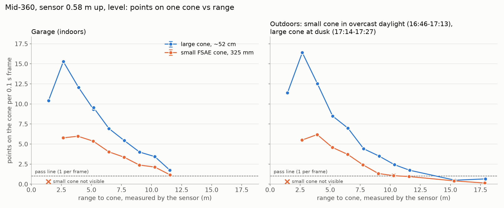
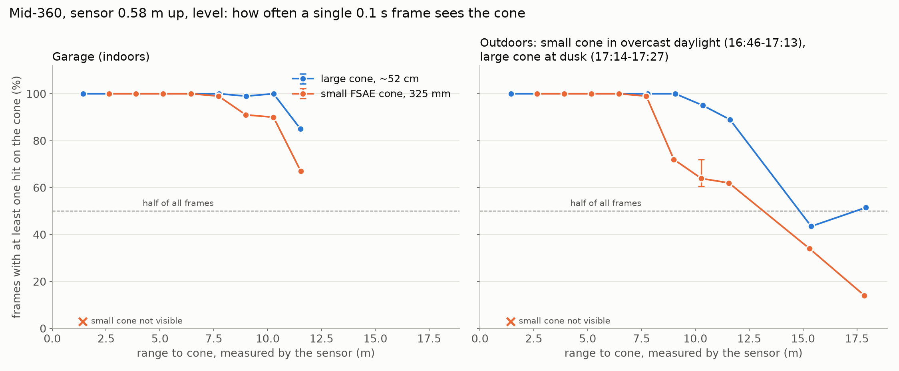
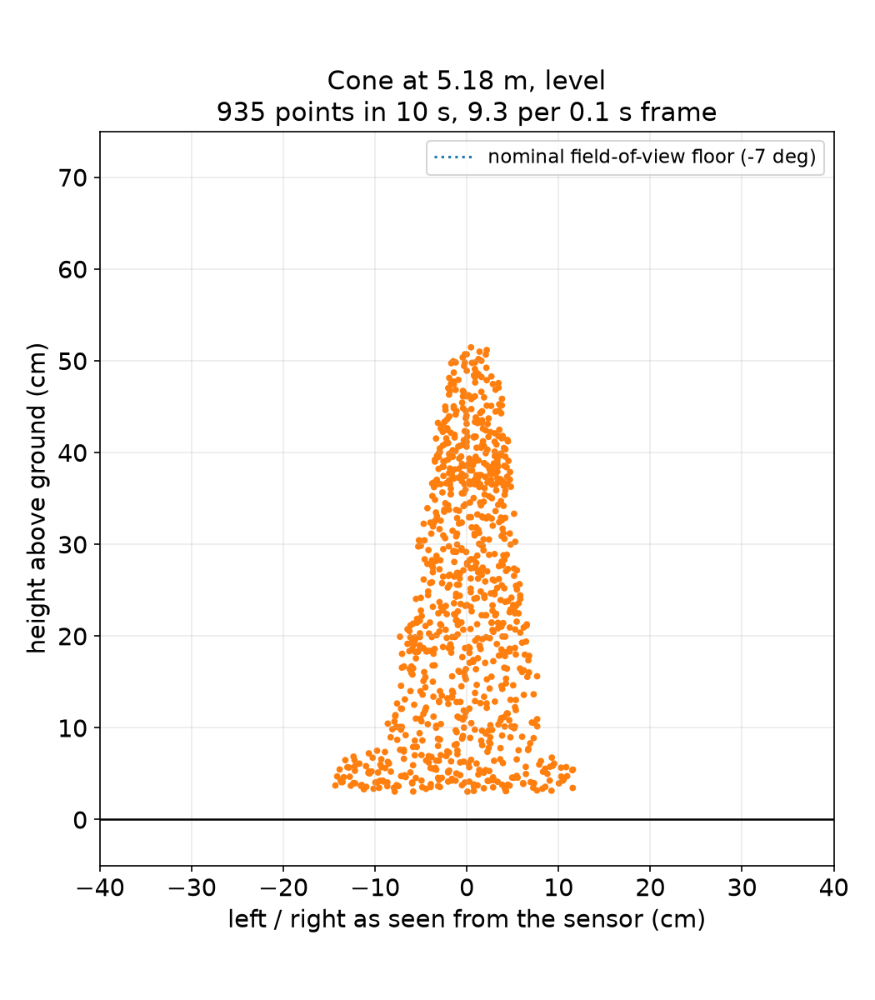
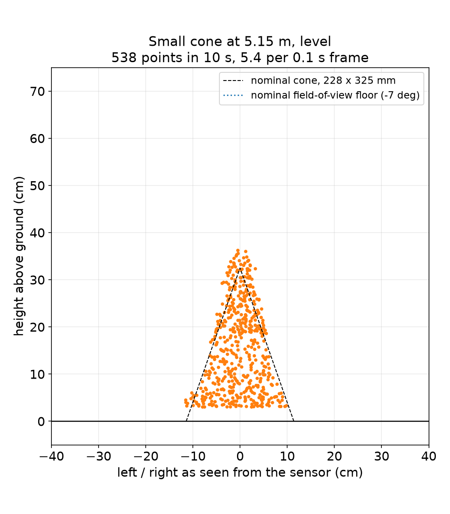
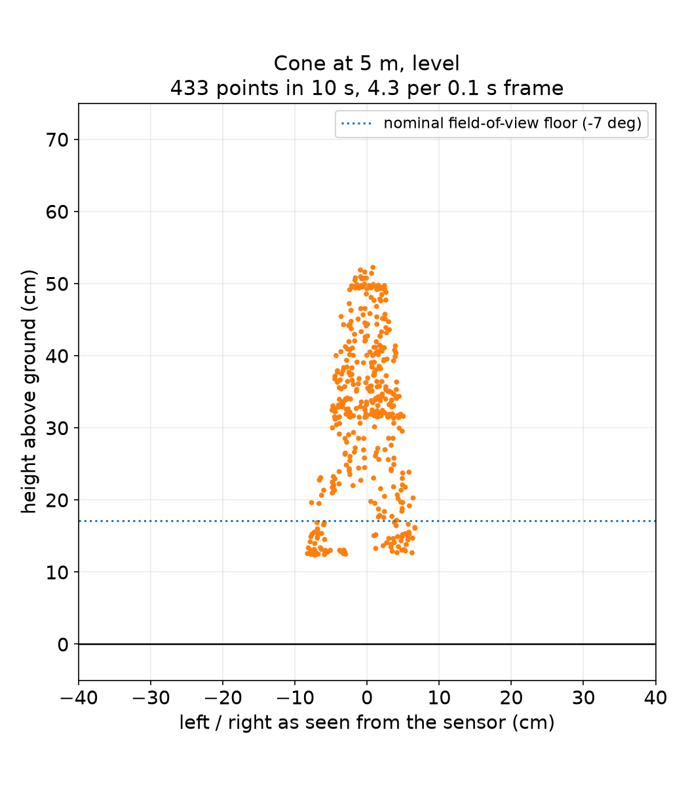
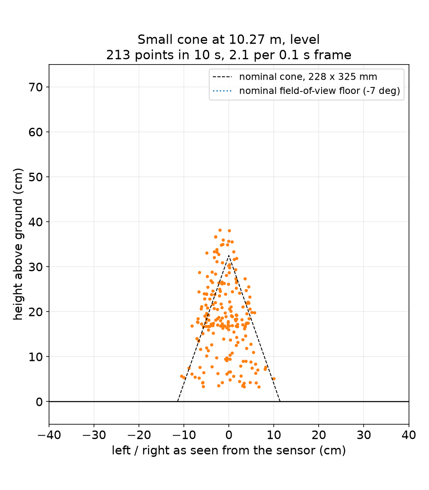
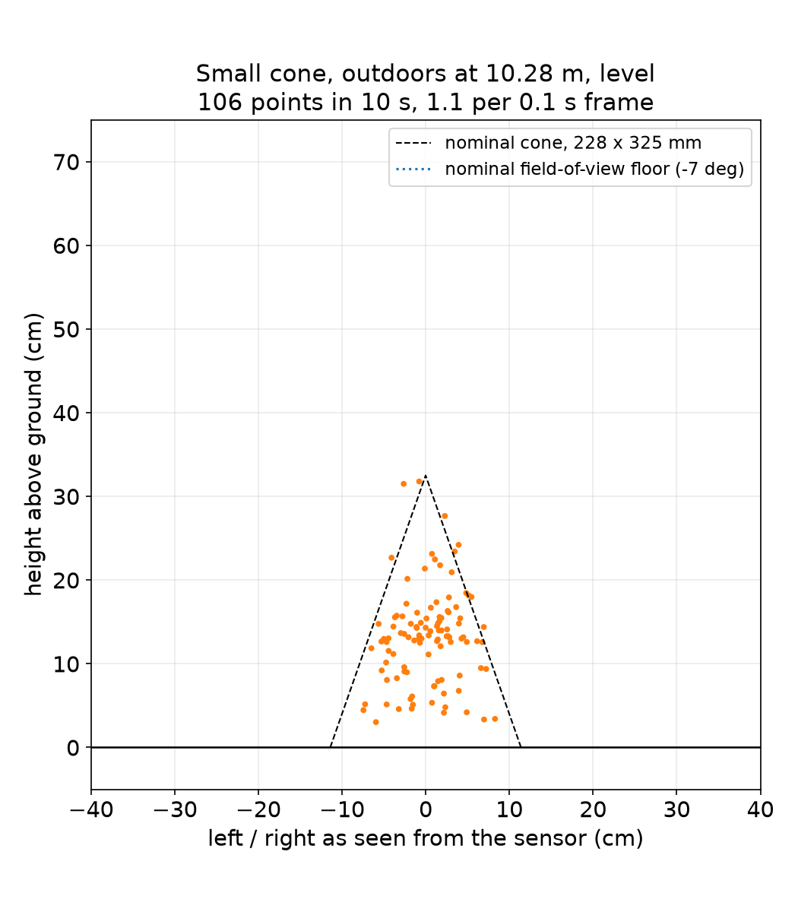
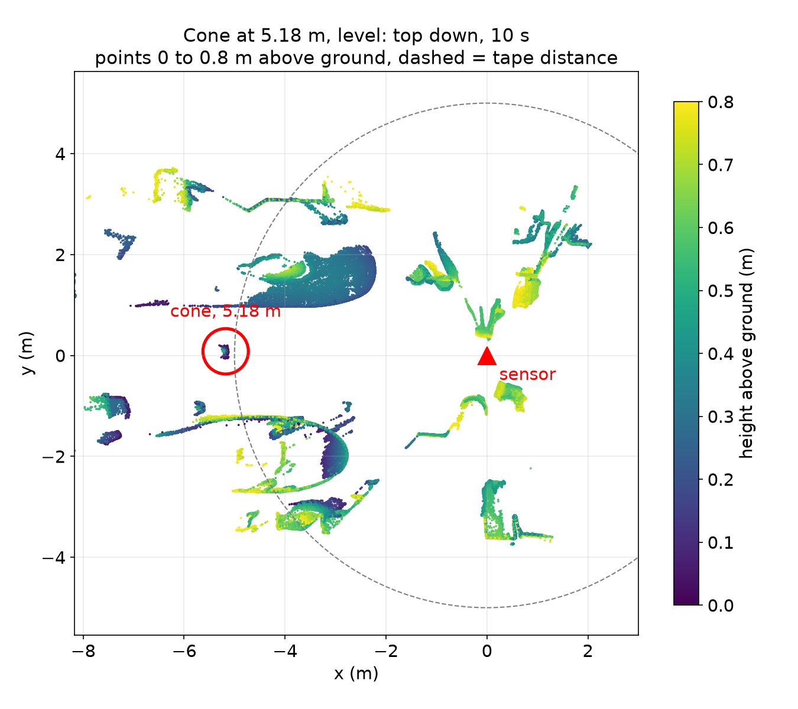
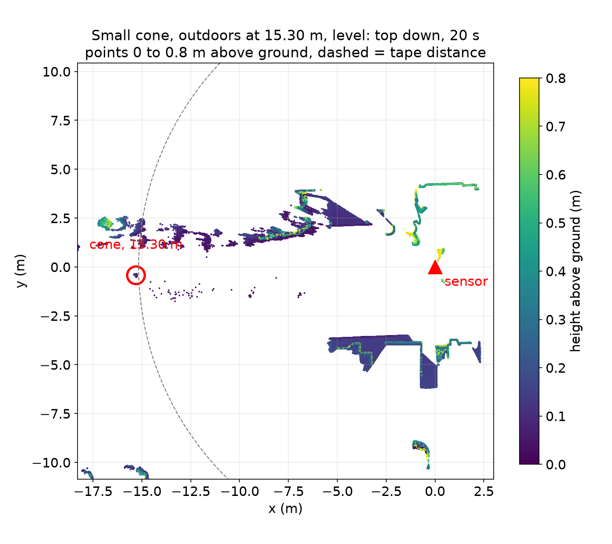

# Mid-360 acceptance test, 2026-10-04

## Question

A UT lab donated a Livox Mid-360 that had been dropped hard at least once.
Is it good enough to be the car's LiDAR, and how far does it see a cone at
the height it would sit on the car? The checks and pass lines come from the
LiDAR Test Plan in the Notion wiki.

## Result

**Car sensor, provisional.** The optics, the scan, and the data link are
healthy. The 60 minute endurance run and the connector wiggle test were not
run, so the verdict is not final.

- **No sign of drop damage.** 200,000 points/s for about 3 hours of
  streaming, with packets lost only during host-side outages (below). Walls and ceiling are flat to
  0.5 to 0.7 cm, a room corner measures 89.7°, and the point cloud agrees
  with IMU gravity to 0.3°.
- **Pass line, small cone at 10 m (at least 50 points in 5 s):** 103 in the
  garage, a pass. Outdoors under full overcast, 46, 49 and 51 in three runs
  (average 49, a marginal fail), and 65 as the light faded.
- **Daylight costs range.** Under cloud, with no direct sun, small-cone hits
  at 9 to 10 m are about half of the garage count. The points that do return
  are as bright as indoors, so ambient light is dropping the weak returns.
  Direct sun was not tested and will be worse.
- **Useful range for a small cone in daylight is about 8 m frame by frame,
  10 to 12 m with stacking.** At 7.7 m the cone is in 99% of 0.1 s frames.
  At 10.3 m it is in about 60%, at 15.3 m in 34%, at 17.9 m in 14%.
- **The near field is blind at this mount.** With the sensor 0.58 m up and
  level, a cone is fully in view only from about 3.9 m. The small cone is
  not visible at all at 1.4 m.
- **Pitch matters.** The same 5 m cone got 433 points in 10 s with the
  sensor tipped 2.5° up on the cone side and 935 when level. The tilt put the
  bottom of the cone out of view.
- **Gyro bias fails the plan's 1 °/s limit and moves with temperature:**
  X axis -1.2 °/s at 46 °C, -2.8 °/s at 57 °C, -4.3 °/s at 66 °C. Stable at
  a fixed temperature, so the EKF can estimate it, but not as a one-time
  calibration.

### What it means for the design

- Perception has to stack frames with odometry to see small cones past
  about 8 m in daylight, and the camera has to carry range beyond 10 to
  12 m.
- Mount height and pitch set the near-field blind zone and the point count,
  so they are design numbers. Put them in `vehicle.yaml` with the other
  sensor mounts.
- Cones disappear under the field of view as the car reaches them, so the
  track builder keeps cones it saw earlier.
- State estimation estimates the gyro bias online.

### Results by range

Points per 0.1 s frame. All runs 10 s (20 s past 12 m), sensor level, no
packets lost in any logged run. Full table:
[results.csv](https://github.com/LonghornRacingElectric/lhre/blob/main/autonomy/testing/2026-10-04-mid360-acceptance/results.csv).

| Range | Large cone, garage | Small cone, garage | Small cone, outdoors | Large cone, outdoors (dusk) |
| ----- | ------------------ | ------------------ | -------------------- | --------------------------- |
| 1.4 m | 10.4, top 14 cm only | not visible | not visible | 11.4, top only |
| 2.7 m | 15.3 | 5.8, top only | 5.5, top only | 16.4 |
| 3.9 m | 12.1 | 6.0 | 6.2 | 12.5 |
| 5.2 m | 9.3 and 9.5 (repeat) | 5.4 | 4.6 | 8.5 |
| 6.5 m | 6.9 | 4.0 | 3.7 | 7.0 |
| 7.7 m | 5.4 | 3.4 | 2.4 | 4.4 |
| 9.0 m | 4.0 | 2.4 | 1.3 | 3.5 |
| 10.3 m | 3.4 (162 in 5 s) | 2.1 (103 in 5 s) | 0.9 to 1.3 (46 to 65 in 5 s) | 2.4 (113 in 5 s) |
| 11.5 m | 1.7 | 1.2 | 0.95 | 1.7 |
| 15.3 m | | | 0.41 | 0.49 |
| 17.9 m | | | 0.14 | 0.65 |

The cone as the sensor sees it, 10 s of points:

| Large cone, 5.2 m | Small cone, 5.2 m | Large cone, 5.2 m, tipped 2.5° |
| ----------------- | ----------------- | ------------------------------ |
|  |  |  |

| Small cone, 10.3 m, garage | Small cone, 10.3 m, outdoors |
| -------------------------- | ---------------------------- |
|  |  |

| Garage, cone at 5.2 m | Outdoors, small cone at 15.3 m |
| --------------------- | ------------------------------ |
|  |  |

### Not run yet

- 60 minute endurance, then tap, flex and shake the connector while
  streaming. The longest clean stretch was about 13 minutes.
- IMU axis rolls and the visual inspection (window, pins, bearing noise).
- Range bias against a tape. The tape was read 10 to 18 cm short of the
  sensor at every position, a constant offset in how it was laid, so
  distances here are the sensor's.
- The 3° down-tilt series, direct sun, and the sun inside the field of view.

### Faults that were not the sensor

- The Mac's USB Ethernet adapter re-enumerated five times, each a 5 to 6 s
  gap. It never landed inside a recording.
- The bench supply cut its output once outdoors (0 V, 0 A). Restarting it
  restored the sensor.
- The Mac went to sleep on battery and stopped the streamer. Run it under
  `caffeinate`.

## Method

- **Setup.** Sensor on a stand 0.58 m above the floor, levelled with the
  IMU to within 1.4°. Cones placed on a line behind the sensor (bearing
  180°), at 50 inch steps by tape to 450 in, then 597 and 697 in. Garage first, then the driveway in front
  of it. Host: a MacBook on a USB Ethernet adapter at 192.168.1.50, sensor at
  192.168.1.134.
- **Recording.** [`tools/livox/`](../tools/livox/README.md) talks to the
  sensor directly over its UDP protocol (no ROS on the Mac), streams to
  Foxglove, and records each position to MCAP and `.npz` on demand.
- **Finding the cone.** Level the cloud with IMU gravity, keep points 3 to
  80 cm above the floor, cluster on a 10 cm grid, and take the cone-shaped
  cluster nearest the expected range. Past 12 m, the cone is also checked
  against a run with the cone elsewhere, to rule out bushes and curbs.
- **Metrics.** Points on the cone per 0.1 s frame (the sensor's 10 Hz
  frame), the share of frames with at least one hit, and points in the
  first 5 s (the test plan's pass line).
- **Lighting.** Garage: indoor light. Outdoors 16:46 to 17:13: overcast, 84%
  low cloud, 0 W/m² direct and about 110 to 250 W/m² diffuse (Open-Meteo for
  the Pickle Research Campus), sun 30° up at 244°, off to the side. Outdoors
  17:14 to 17:27 (large cone): dusk.
- **Cones.** Small: FSAE small cone, 325 mm. Large: orange, about 52 cm
  measured, type not confirmed.

## Provenance

- Unit: Mid-360 S/N 47MCN860030034, firmware 13.18.2.40, loader 13.17.99.20.
- Date: 2026-10-04, 14:24 to 17:29 CDT. Timestamped log: [log.md](log.md).
- Raw data (2.8 GB: per-run MCAP and `.npz`, health logs, every figure):
  shared team storage, location to be added. A copy is on the test laptop at
  `~/lhr-test-data/2026-10-04-mid360-acceptance/`. ROS 2 bags of every run,
  made with `ros2_bag.py`, go in the same storage under `ros2/`.
- Earlier bench run (2026-09-27): LiDAR Test Plan page in the Notion wiki.
