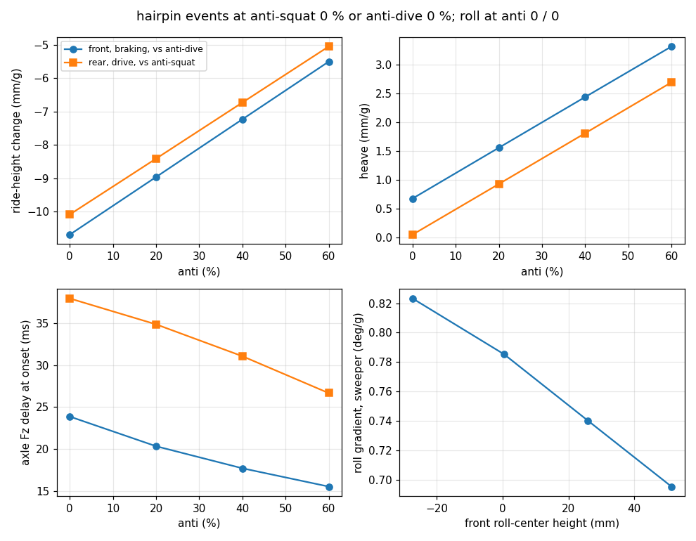
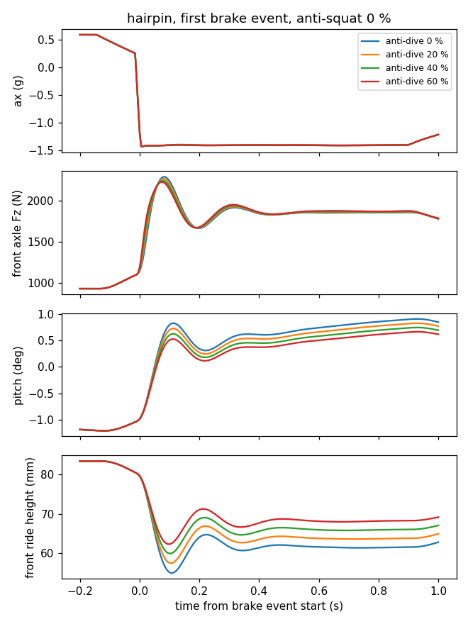

# anti-geometry

## Question

How do front anti-dive, rear anti-squat and roll-center height change ride-height control, tire-load transients
and lap behavior of the current car on transient tracks?

The answer sets the anti-dive, anti-squat and roll-center targets for the next car.

## Method

### Physics the study measures

- Steady longitudinal load transfer is m·a·h/L. Anti does not change it. Anti sets the share of it that the
  links carry. The springs carry the rest (RCVD 17.3, p. 617–618).
- So spring deflection, pitch and ride-height change scale with (1 − anti). Anti is the aero platform benefit.
- The link share reaches the tire with Fx, with no lag. The spring share goes through the pitch dynamics. So
  anti changes how the axle load gets to its steady value, not the steady value.
- Anti acts only with Fx. The car is rear-wheel drive, so there is no front anti-lift. Rear anti-lift is
  0.16 × anti-squat at brake bias 0.84.
- An anti-roll bar only splits the elastic lateral load transfer. The geometric analogue of anti is roll-center
  height, so the study sweeps roll-center (RC) height for "anti-roll".

### Tier

dyn_py 14DOF transient lap (`simulate_transient_lap`), sampled at 5 ms. It is the only BobSim tier that drives a
track with braking and drive. Wheel rates, damping and anti-roll bar rates come from the baseline four-post
metrics and are the same for every car.

dyn_py reads these rates only from the four-post metrics file. Without it, dyn_py uses motion ratio 1 and no
anti-roll bar, and does not say so. Thus `run.py` stops if the file is missing. Make it once before the study:
`make records`, `make bobsim T=standard-build-four-post`, `make bobsim T=standard-eval-four-post`, then
`make records-undo`.

### Cars

| Set | Cars | How `run.py` makes them |
| --- | ---- | ----------------------- |
| Anti grid | anti-dive {0, 20, 40, 60} % × anti-squat {0, 20, 40, 60} %, named `adXX_asYY` | Tilt both inner pivot axes of an axle to one side-view angle. Rotate each axis about the point where it crosses the transverse plane through the wheel center. Only the z of the four inner pivots changes. A root find sets the angle. |
| RC sweep | RC {0, 25, 50} mm, front and rear, at anti 0/0, named `rcXX` | Move all four inner pivots of an axle by the same Δz. A root find sets Δz. Then tilt the axes as for the anti grid to set anti back to 0 %. The pivot move alone adds up to 25 % anti-dive. The tilt moves the RC by less than 1.5 mm. |
| Baseline | `vehicle/vehicle.yml` as it is | — |

`run.py` writes each car to `out/anti-geometry/cars/<car>.yml`. It reads anti and RC from the BobSim
instant-link coefficients at static ride height, with the dyn_py convention (h is the total CG height from the
ground, L the wheelbase, f the front brake fraction):

- anti-dive % = −100 · C_x,front · f · L/h
- anti-squat % = 100 · C_x,rear · L/h, and anti-lift % = anti-squat % · (1 − f)
- RC height = −C_y · t/2

<!-- out:geometry.md -->

| Car | Anti-dive (%) | Anti-squat (%) | Anti-lift (%) | RC front / rear (mm) | Anti-dive at -25 / +25 mm (%) | Anti-squat at -25 / +25 mm (%) | Camber gain front / rear (deg/mm) | Pivot move front / rear (mm) |
| --- | ---: | ---: | ---: | ---: | ---: | ---: | ---: | ---: |
| baseline | -2.4 | -4.9 | -0.8 | -27 / -15 | -2.2 / -2.6 | -6.9 / -2.7 | -0.026 / -0.034 | 0.0 / 0.0 |
| ad00_as00 | -0.0 | 0.0 | 0.0 | -27 / -15 | 0.2 / -0.2 | -2.0 / 2.0 | -0.026 / -0.034 | 0.3 / 8.0 |
| ad00_as20 | -0.0 | 20.0 | 3.2 | -27 / -15 | 0.2 / -0.2 | 18.0 / 22.0 | -0.026 / -0.034 | 0.3 / 7.1 |
| ad00_as40 | -0.0 | 40.0 | 6.4 | -27 / -16 | 0.2 / -0.2 | 38.0 / 42.0 | -0.026 / -0.034 | 0.3 / 15.6 |
| ad00_as60 | -0.0 | 60.0 | 9.6 | -27 / -17 | 0.2 / -0.2 | 58.0 / 62.1 | -0.026 / -0.034 | 0.3 / 24.1 |
| ad20_as00 | 20.0 | 0.0 | 0.0 | -28 / -15 | 20.2 / 19.8 | -2.0 / 2.0 | -0.026 / -0.034 | 4.6 / 8.0 |
| ad20_as20 | 20.0 | 20.0 | 3.2 | -28 / -15 | 20.2 / 19.8 | 18.0 / 22.0 | -0.026 / -0.034 | 4.6 / 7.1 |
| ad20_as40 | 20.0 | 40.0 | 6.4 | -28 / -16 | 20.2 / 19.8 | 38.0 / 42.0 | -0.026 / -0.034 | 4.6 / 15.6 |
| ad20_as60 | 20.0 | 60.0 | 9.6 | -28 / -17 | 20.2 / 19.8 | 58.0 / 62.1 | -0.026 / -0.034 | 4.6 / 24.1 |
| ad40_as00 | 40.0 | 0.0 | 0.0 | -29 / -15 | 40.2 / 39.8 | -2.0 / 2.0 | -0.025 / -0.034 | 9.1 / 8.0 |
| ad40_as20 | 40.0 | 20.0 | 3.2 | -29 / -15 | 40.2 / 39.8 | 18.0 / 22.0 | -0.025 / -0.034 | 9.1 / 7.1 |
| ad40_as40 | 40.0 | 40.0 | 6.4 | -29 / -16 | 40.2 / 39.8 | 38.0 / 42.0 | -0.025 / -0.034 | 9.1 / 15.6 |
| ad40_as60 | 40.0 | 60.0 | 9.6 | -29 / -17 | 40.2 / 39.8 | 58.0 / 62.1 | -0.025 / -0.034 | 9.1 / 24.1 |
| ad60_as00 | 60.0 | 0.0 | 0.0 | -30 / -15 | 60.2 / 59.7 | -2.0 / 2.0 | -0.024 / -0.034 | 13.6 / 8.0 |
| ad60_as20 | 60.0 | 20.0 | 3.2 | -30 / -15 | 60.2 / 59.7 | 18.0 / 22.0 | -0.024 / -0.034 | 13.6 / 7.1 |
| ad60_as40 | 60.0 | 40.0 | 6.4 | -30 / -16 | 60.2 / 59.7 | 38.0 / 42.0 | -0.024 / -0.034 | 13.6 / 15.6 |
| ad60_as60 | 60.0 | 60.0 | 9.6 | -30 / -17 | 60.2 / 59.7 | 58.0 / 62.1 | -0.024 / -0.034 | 13.6 / 24.1 |
| rc00 | 0.0 | 0.0 | 0.0 | 0 / 0 | 0.2 / -0.1 | -2.0 / 2.0 | -0.028 / -0.033 | 15.8 / 8.3 |
| rc25 | 0.0 | 0.0 | 0.0 | 26 / 25 | 0.0 / 0.1 | -2.0 / 2.0 | -0.030 / -0.030 | 29.9 / 22.8 |
| rc50 | 0.0 | 0.0 | 0.0 | 51 / 50 | -0.2 / 0.5 | -2.0 / 2.0 | -0.032 / -0.028 | 44.1 / 37.4 |

<!-- /out -->

### Tracks

Three asymmetric ovals from [`tools/oval.py`](../../docs/oval.md). Each has two variable-radius corners and two
tangent straights. The track is 4 m wide and the driver follows the centerline.

<!-- out:tracks.md -->

| Track | L (m) | R0 / R1 (m) | R0' / R1' (m/rad) | Turn 0 / 1 (deg) | Straights (m) | Lap (m) | Target lap (s) | Lap time, all cars (s) | RMS lateral error, all cars (m) |
| --- | ---: | ---: | ---: | ---: | ---: | ---: | ---: | ---: | ---: |
| hairpin | 70 | 9 / 9 | 2.5 / -2.5 | 180 / 180 | 65.0 / 75.0 | 197 | 13.24 | 13.90..14.11 | 0.286..0.293 |
| template | 60 | 15 / 9 | 2 / -1.5 | 191 / 169 | 56.1 / 63.3 | 196 | 12.73 | 13.12..13.20 | 0.195..0.206 |
| sweeper | 40 | 25 / 15 | 0 / 0 | 209 / 151 | 38.7 / 38.7 | 208 | 12.06 | 12.37..12.38 | 0.140..0.148 |

<!-- /out -->

- `hairpin`: long straights into tight corners. It gives the longest brake and drive events. Checks 1, 2, 3 and
  6 use it.
- `template`: a mixed oval, with one opening corner and one tightening corner.
- `sweeper`: two constant-radius corners. It gives steady cornering for the RC metrics and the anti null check.

The driver target is one quasi-steady lap per track from a friction ellipse: 1.3 g lateral, 1.3 g braking and
0.6 g drive (power-limited). Every car follows the same target. So lap time checks that the driver followed the
target. It is not a performance result.

### Metrics

Event windows come from the shared target, so they are the same for every car. A window starts and ends 0.3 s
inside each event.

| Window | Rule |
| ------ | ---- |
| Brake | straight, target ax below −0.65 g |
| Drive | straight, target ax above 0.25 g |
| Steady corner | corner, target \|ax\| below 0.05 g |

| Metric | How |
| ------ | --- |
| Pitch, heave, ride height, axle Fz and link force per g | Fit Y − Y_static = a · ax + b · v² over the brake or drive window. a is the value per g. b takes out aero. |
| Link share | Link force per g ÷ axle Fz per g. This is the anti % that the car achieves on track. |
| Fz delay at onset | Time from the 50 % crossing of ax to the 50 % crossing of the axle Fz, from the level 0.5 s before the event to the level 0.3–0.6 s after it. The mean over the lap's events. |
| Fz overshoot at onset | Peak axle Fz above its 0.3–0.6 s level, as % of the change. |
| Map downforce | Evaluate the aero map (Orion's, see [Confidence](#confidence)) at each sample's front and rear ride height. Report the std and range over the lap, in % of the static value. This is one-way: the sim's own downforce does not change with ride height. |
| Roll gradient, front LLTD, heave | Mean over the `sweeper` steady-corner windows. |
| Turn-in yaw delay and roll overshoot | The same 50 % method at the `sweeper` corner entries, from steer to yaw rate and to roll. |

`out/anti-geometry/traces/<car>_<track>.csv` has every channel against time and station for each car. Plot two
of them on the same station axis to compare two cars.

`run.py` also writes these figures to `out/anti-geometry/`. This README does not show them.

| Figure | Content |
| ------ | ------- |
| `lap_<track>.png` | The baseline car over one lap: speed and driver target, ax and ay, pitch and roll, ride heights, wheel Fz and map downforce against station. Grey bands are corners. |
| `track_maps.png` | Each track, colored by speed, ax, front and rear ride height and map downforce of the baseline car. |
| `drive.png` | The first `hairpin` drive event at anti-dive 0 %, anti-squat 0 to 60 %: ax, rear axle Fz, pitch and rear ride height against time. |
| `turn_in.png` | The first `sweeper` corner entry for the four RC levels at anti 0/0: steer, yaw rate, roll, heave and outer front Fz against time. |
| `anti_grid.png` | Heat maps of the anti-grid metrics over anti-dive and anti-squat on `hairpin`. Each panel has its own color scale. |

### Checks

`run.py` stops with an error if a check fails.

1. Link force per g matches the design value, anti % × m·g·h/L, within 3 % of m·g·h/L. The link share is also
   reported.
2. The ride-height change scales with the spring share (1 − link share), within 10 %.
3. The steady axle Fz per g is the same for every anti car, within 4 % (max − min over the mean).
4. In the `sweeper` steady corners, the anti cars differ by less than 1 % in roll and front ride height and 2 %
   in outer front Fz.
5. ax and ay from the re-evaluated model outputs match the stored signals.
6. The front ride height falls in braking for the 0/0 car.
7. The roll gradient falls as RC height rises.

## Result

All checks pass for the 20 cars. The numbers below come from the run in [Provenance](#provenance).

### Anti-dive and anti-squat

Each metric is linear in anti-dive and anti-squat. The table fits a plane to the 16 grid cars on `hairpin`:
value = fit at 0/0 + slope × (anti ÷ 10 %). The last column is the largest difference between the plane and a
car. Use the plane to rebuild any car in the grid, or a car between the grid points.

<!-- out:fits.md -->

| Metric | Fit at AD 0 / AS 0 | Per +10 % anti-dive | Per +10 % anti-squat | Max fit error |
| --- | ---: | ---: | ---: | ---: |
| Front ride-height change in braking (mm/g) | -10.7 | +0.86 | -0.01 | 0.01 |
| Rear ride-height change in drive (mm/g) | -10.1 | +0.00 | +0.84 | 0.00 |
| Pitch in braking (deg/g) | 0.82 | -0.031 | -0.005 | 0.001 |
| Pitch in drive (deg/g) | -0.78 | +0.000 | +0.031 | 0.000 |
| Heave in braking (mm/g) | +0.7 | +0.44 | -0.08 | 0.00 |
| Heave in drive (mm/g) | +0.1 | +0.00 | +0.44 | 0.00 |
| Map downforce std over the lap (%) | 7.6 | -0.12 | -0.11 | 0.00 |
| Front Fz delay at brake onset (ms) | 23.5 | -1.38 | +0.05 | 0.47 |
| Front Fz overshoot at brake onset (%) | 47 | -1.6 | -0.1 | 0.3 |
| Rear Fz delay at drive onset (ms) | 38.2 | +0.20 | -1.88 | 0.37 |
| Rear Fz overshoot at drive onset (%) | 8 | -0.0 | +0.1 | 0.1 |

<!-- /out -->



- **Platform.** Anti-dive cuts the front ride-height change in braking from
  <!-- out:summary.json#cars/ad00_as00/tracks/hairpin/brake_ride_front_per_g|+.1f -->−10.7<!-- /out --> mm/g at 0 % to
  <!-- out:summary.json#cars/ad60_as00/tracks/hairpin/brake_ride_front_per_g|+.1f -->−5.5<!-- /out --> mm/g at 60 %.
  Anti-squat cuts the rear ride-height change in drive from
  <!-- out:summary.json#cars/ad00_as00/tracks/hairpin/drive_ride_rear_per_g|+.1f -->−10.1<!-- /out --> to
  <!-- out:summary.json#cars/ad00_as60/tracks/hairpin/drive_ride_rear_per_g|+.1f -->−5.1<!-- /out --> mm/g. Anti-dive
  has no effect in drive. Anti-squat has almost no effect in braking.
- Each +10 % removes about 8 % of the 0 % value, not 10 %. The springs carry (1 − anti) of the load transfer,
  but the tire deflection does not change with anti. Calc: the front tires deflect 441 N/g ÷ 2 ÷ 98.9 N/mm =
  2.2 mm/g. The plane at 100 % anti-dive leaves 10.7 − 8.6 = 2.1 mm/g.
- **Pitch.** Pitch in braking falls from
  <!-- out:summary.json#cars/ad00_as00/tracks/hairpin/brake_pitch_per_g|.2f -->0.82<!-- /out --> to
  <!-- out:summary.json#cars/ad60_as00/tracks/hairpin/brake_pitch_per_g|.2f -->0.63<!-- /out --> deg/g at 60 %
  anti-dive. Anti-squat also cuts braking pitch a little, because rear anti-lift is 0.16 × anti-squat.
- **Aero.** The map downforce std over the lap falls from
  <!-- out:summary.json#cars/ad00_as00/tracks/hairpin/map_downforce_std_pct|.1f -->7.6<!-- /out --> % at 0/0 to
  <!-- out:summary.json#cars/ad60_as60/tracks/hairpin/map_downforce_std_pct|.1f -->6.2<!-- /out --> % at 60/60. The
  sim does not feed this back into its own downforce (see [Confidence](#confidence)).
- **Body rise.** The loaded axle compresses less, so the body rises more in braking and in drive: +0.44 mm/g of
  heave per +10 % anti. This lifts the CG. The steady front axle load in braking goes from
  <!-- out:summary.json#cars/ad00_as00/tracks/hairpin/brake_fz_front_per_g|.0f -->441<!-- /out --> N/g at 0 % to
  <!-- out:summary.json#cars/ad60_as00/tracks/hairpin/brake_fz_front_per_g|.0f -->450<!-- /out --> N/g at 60 %
  anti-dive. Calc: the extra rise at 60 % is 2.6 mm/g × 1.4 g = 3.6 mm, 1.3 % of the CG height. Inf: the CG
  rise causes most of the 2 % load increase. A run with a fixed CG height would confirm it.
- **Tire load.** Anti changes the steady axle load per g by at most 2 % (check 3). Thus WRITE_UP's "Fz
  variation will increase" does not hold for a steady brake or drive event. Anti changes how the load arrives.
  The link share arrives with Fx. The spring share waits for the body to pitch (RCVD 17.3, p. 617). The front
  axle load reaches half of its change
  <!-- out:summary.json#cars/ad00_as00/tracks/hairpin/brake_fz_front_delay_ms|.0f -->24<!-- /out --> ms after ax at
  0 % anti-dive, and <!-- out:summary.json#cars/ad60_as00/tracks/hairpin/brake_fz_front_delay_ms|.0f -->16<!-- /out -->
  ms after ax at 60 %. Its overshoot falls from
  <!-- out:summary.json#cars/ad00_as00/tracks/hairpin/brake_fz_front_overshoot_pct|.0f -->47<!-- /out --> % to
  <!-- out:summary.json#cars/ad60_as00/tracks/hairpin/brake_fz_front_overshoot_pct|.0f -->38<!-- /out --> %. At
  drive onset, the rear delay falls from
  <!-- out:summary.json#cars/ad00_as00/tracks/hairpin/drive_fz_rear_delay_ms|.0f -->38<!-- /out --> ms to
  <!-- out:summary.json#cars/ad00_as60/tracks/hairpin/drive_fz_rear_delay_ms|.0f -->27<!-- /out --> ms at 60 %
  anti-squat. The rear overshoot stays near
  <!-- out:summary.json#cars/ad00_as00/tracks/hairpin/drive_fz_rear_overshoot_pct|.0f -->8<!-- /out --> %.
- The brake input in the sim is almost a step: ax goes from +0.25 g to −1.4 g in about 20 ms. The drive force
  rises over the corner exit. Thus the brake overshoot is large and the drive overshoot is small. A driver ramps
  the brake, so the brake overshoot here is an upper bound.



In the brake event, the front axle load is almost the same for the four anti-dive levels. The pitch and the
front ride height are not.

The full grids:

<!-- out:anti.md -->

| Front ride-height change in braking (mm/g) | AS 0 % | AS 20 % | AS 40 % | AS 60 % |
| --- | ---: | ---: | ---: | ---: |
| AD 0 % | -10.7 | -10.7 | -10.7 | -10.7 |
| AD 20 % | -9.0 | -9.0 | -9.0 | -9.0 |
| AD 40 % | -7.2 | -7.2 | -7.3 | -7.3 |
| AD 60 % | -5.5 | -5.5 | -5.5 | -5.6 |

| Rear ride-height change in drive (mm/g) | AS 0 % | AS 20 % | AS 40 % | AS 60 % |
| --- | ---: | ---: | ---: | ---: |
| AD 0 % | -10.1 | -8.4 | -6.7 | -5.1 |
| AD 20 % | -10.1 | -8.4 | -6.7 | -5.0 |
| AD 40 % | -10.1 | -8.4 | -6.7 | -5.0 |
| AD 60 % | -10.1 | -8.4 | -6.7 | -5.0 |

| Pitch in braking (deg/g) | AS 0 % | AS 20 % | AS 40 % | AS 60 % |
| --- | ---: | ---: | ---: | ---: |
| AD 0 % | 0.82 | 0.81 | 0.79 | 0.78 |
| AD 20 % | 0.76 | 0.74 | 0.73 | 0.72 |
| AD 40 % | 0.69 | 0.68 | 0.67 | 0.66 |
| AD 60 % | 0.63 | 0.62 | 0.61 | 0.60 |

| Pitch in drive (deg/g) | AS 0 % | AS 20 % | AS 40 % | AS 60 % |
| --- | ---: | ---: | ---: | ---: |
| AD 0 % | -0.78 | -0.71 | -0.65 | -0.59 |
| AD 20 % | -0.78 | -0.71 | -0.65 | -0.59 |
| AD 40 % | -0.78 | -0.71 | -0.65 | -0.59 |
| AD 60 % | -0.78 | -0.71 | -0.65 | -0.59 |

| Heave in braking (mm/g) | AS 0 % | AS 20 % | AS 40 % | AS 60 % |
| --- | ---: | ---: | ---: | ---: |
| AD 0 % | +0.7 | +0.5 | +0.3 | +0.2 |
| AD 20 % | +1.6 | +1.4 | +1.2 | +1.1 |
| AD 40 % | +2.4 | +2.3 | +2.1 | +1.9 |
| AD 60 % | +3.3 | +3.1 | +3.0 | +2.8 |

| Heave in drive (mm/g) | AS 0 % | AS 20 % | AS 40 % | AS 60 % |
| --- | ---: | ---: | ---: | ---: |
| AD 0 % | +0.1 | +0.9 | +1.8 | +2.7 |
| AD 20 % | +0.1 | +0.9 | +1.8 | +2.7 |
| AD 40 % | +0.1 | +0.9 | +1.8 | +2.7 |
| AD 60 % | +0.1 | +0.9 | +1.8 | +2.7 |

| Map downforce std over the lap (%) | AS 0 % | AS 20 % | AS 40 % | AS 60 % |
| --- | ---: | ---: | ---: | ---: |
| AD 0 % | 7.6 | 7.4 | 7.2 | 7.0 |
| AD 20 % | 7.4 | 7.2 | 6.9 | 6.7 |
| AD 40 % | 7.1 | 6.9 | 6.7 | 6.5 |
| AD 60 % | 6.9 | 6.7 | 6.5 | 6.2 |

| Front Fz delay at brake onset (ms) | AS 0 % | AS 20 % | AS 40 % | AS 60 % |
| --- | ---: | ---: | ---: | ---: |
| AD 0 % | 23.9 | 23.9 | 24.0 | 24.1 |
| AD 20 % | 20.3 | 20.7 | 20.8 | 20.9 |
| AD 40 % | 17.7 | 17.7 | 17.7 | 17.8 |
| AD 60 % | 15.5 | 15.8 | 15.8 | 15.8 |

| Front Fz overshoot at brake onset (%) | AS 0 % | AS 20 % | AS 40 % | AS 60 % |
| --- | ---: | ---: | ---: | ---: |
| AD 0 % | 47 | 47 | 47 | 47 |
| AD 20 % | 44 | 44 | 43 | 43 |
| AD 40 % | 41 | 40 | 40 | 40 |
| AD 60 % | 38 | 37 | 37 | 37 |

| Rear Fz delay at drive onset (ms) | AS 0 % | AS 20 % | AS 40 % | AS 60 % |
| --- | ---: | ---: | ---: | ---: |
| AD 0 % | 37.9 | 34.8 | 31.1 | 26.7 |
| AD 20 % | 38.3 | 35.2 | 31.5 | 27.0 |
| AD 40 % | 38.7 | 35.6 | 31.9 | 27.4 |
| AD 60 % | 39.1 | 36.0 | 32.3 | 27.8 |

| Rear Fz overshoot at drive onset (%) | AS 0 % | AS 20 % | AS 40 % | AS 60 % |
| --- | ---: | ---: | ---: | ---: |
| AD 0 % | 8 | 8 | 8 | 8 |
| AD 20 % | 8 | 8 | 8 | 9 |
| AD 40 % | 8 | 8 | 8 | 9 |
| AD 60 % | 8 | 8 | 8 | 9 |

<!-- /out -->

### Roll-center height

<!-- out:rc.md -->

| Car | RC front / rear (mm) | Pivot move front / rear (mm) | Roll (deg/g) | Front LLTD (%) | Heave (mm) | Yaw delay (ms) | Roll overshoot (%) |
| --- | ---: | ---: | ---: | ---: | ---: | ---: | ---: |
| ad00_as00 | -27 / -15 | 0.3 / 8.0 | 0.823 | 50.1 | -4.3 | 41 | 7 |
| rc00 | 0 / 0 | 15.8 / 8.3 | 0.785 | 50.8 | -3.8 | 44 | 7 |
| rc25 | 26 / 25 | 29.9 / 22.8 | 0.740 | 50.9 | -3.3 | 46 | 6 |
| rc50 | 51 / 50 | 44.1 / 37.4 | 0.695 | 50.9 | -2.6 | 46 | 7 |

<!-- /out -->

- The roll gradient on `sweeper` falls from
  <!-- out:summary.json#cars/ad00_as00/tracks/sweeper/steady/roll_deg_per_g|.3f -->0.823<!-- /out --> deg/g at the
  baseline RC to <!-- out:summary.json#cars/rc50/tracks/sweeper/steady/roll_deg_per_g|.3f -->0.695<!-- /out --> deg/g at
  50 mm. The fall is close to linear in RC.
- Front LLTD rises from
  <!-- out:summary.json#cars/ad00_as00/tracks/sweeper/steady/lltd_front_pct|.1f -->50.1<!-- /out --> % at the baseline
  RC to <!-- out:summary.json#cars/rc00/tracks/sweeper/steady/lltd_front_pct|.1f -->50.8<!-- /out --> % at 0 mm. The
  baseline front RC is about 13 mm below the rear RC, so the front RC rises more. From 0 to 50 mm, the front and rear
  RC move together and the front LLTD does not change.
- The body heave in the steady corner rises with RC. This is jacking: a higher RC lifts the body in a corner.
- The turn-in yaw delay rises from
  <!-- out:summary.json#cars/ad00_as00/tracks/sweeper/turn_in_yaw_delay_ms|.0f -->41<!-- /out --> ms at the baseline
  RC to <!-- out:summary.json#cars/rc50/tracks/sweeper/turn_in_yaw_delay_ms|.0f -->46<!-- /out --> ms at 50 mm. This
  study did not isolate the cause. The RC cars also change camber gain (see the car table). The roll overshoot
  does not change with RC.
- The RC cars have 0 % static anti, but they carry link force on the straights. On `hairpin`, rc50 carries
  <!-- out:summary.json#cars/rc50/tracks/hairpin/brake_link_share_front_pct|.0f -->10<!-- /out --> % of the front
  load transfer in braking and
  <!-- out:summary.json#cars/rc50/tracks/hairpin/drive_link_share_rear_pct|.0f -->12<!-- /out --> % of the rear load
  transfer in drive. Thus it pitches less than ad00_as00. Obs: the link force is C_x·Fx + C_y·Fy at each wheel
  ([`lookup.py`](https://github.com/BobDyn/BobSim/blob/4da577af1b04d86c53706eb6e80fb0064f71cee6/_0_Utils/kin_py/lookup.py)).
  The front has no Fx in drive, but rc50 has
  <!-- out:summary.json#cars/rc50/tracks/hairpin/drive_link_front_per_g|.0f -->−55<!-- /out --> N/g of front link
  force in drive. So the C_y·Fy term causes it. Inf: the left and right Fy change in opposite directions with
  travel, and a high RC turns this into a vertical force. A plot of each wheel's Fy on a straight would confirm
  it.
- The pivot moves are large:
  <!-- out:summary.json#cars/rc50/geometry/pivot_move_front_mm|.0f -->44<!-- /out --> mm at the front for 50 mm RC.
  Check packaging before you use these cars.

### Use for the targets

- The sim sees only the benefits: less ride-height change, less pitch and roll, and a faster axle load. Each
  benefit is linear from 0 to 60 %, with no knee. Thus the sim alone gives no optimum. It gives the benefit per
  +10 % in the fit table.
- The costs are outside the model: Fx to Fz coupling over bumps, link loads, brake hop and steering kickback
  (RCVD 12.3, p. 404; 17.3, p. 621). Trade them against the fit table.
- Prior: on the Chaparral, 33 % front anti-dive "turned out to be a reasonable compromise", with the front-view
  instant center on the ground to prevent jacking. The rear had 100 % anti-squat and anti-lift for pitch (RCVD
  13, p. 454). Calc: at 30 % anti-dive, the plane gives 24 % less front ride-height change per g and a 4 ms
  faster front axle load than at 0 %.

### Confidence

**Math.**

- Check 1: the link force per g matches the design value within 3 % of m·g·h/L (14 N/g) for all 16 grid cars.
  At 0 % anti, the front link force in braking is about −10 N/g and the rear about −3 N/g. This study did not
  find the cause. The RC cars show a larger offset (see [Roll-center height](#roll-center-height)).
- Check 2: the spring deflection follows the spring share (1 − link share) within 10 %.
- The tire-deflection Calc above matches the plane to 0.1 mm/g.
- The plane fits each grid metric to within the error in the fit table.

**Scope.** These effects are not in the model. The arrow gives the direction that each one moves the result.

- No road input. Bumps send Fx into Fz through the links. This is the main cost of anti. → The sim
  over-states the net benefit of anti.
- No link loads, brake hop or steering kickback. → The same.
- One-way aero. The sim's downforce does not change with ride height. The map metric shows the change, but the
  lap does not feel it. → The sim under-states the benefit of anti on track.
- The aero map uses the mean ride height of each axle. It cannot see roll. → The RC sweep shows no aero effect
  by construction.
- The tire is tanh, with no Fy peak. Grip sees Fz overshoot only through load sensitivity.
- The brake input is almost a step. → The brake overshoot is an upper bound.
- Every car follows the same driver target, so lap time is a tracking check, not a result. The RMS lateral error
  on `hairpin` is about 0.29 m for every car (see the track table).
- The Michigan endurance track is not in the study. dyn_py's Radau solver stops with a non-finite state on it at
  BobSim 4da577a.
- Anti changes by about ±2 % over ±25 mm of travel (see the car table). The study reads anti at static ride
  height.

**Inputs.**

- Aero map: `vehicle.yml` uses the map of Orion, last year's car, with a scaled center of pressure. It is a
  placeholder until the aero team gives a map for this car. It puts the center of pressure 1622 mm behind the
  front axle, which is −5 % front balance at 76.2/76.2 mm. Thus use the map downforce numbers as a ranking
  only. The ride-height fits take out aero with the v² term.
- Static ride height: `vehicle.yml` has none, so dyn_py uses 76.2 mm front and rear.
- Wheel rates, damping and anti-roll bar rates come from the four-post metrics file (hash below). They are the
  same for every car.
- The tire grip scale and the tire vertical rate (98.9 N/mm) are not validated against the car.

## Provenance

<!-- out:provenance.json -->

```json
{
  "study": "anti-geometry",
  "bobsim_sha": "4da577af1b04d86c53706eb6e80fb0064f71cee6",
  "vehicle_sha256": "3ab02bbf3e573aad0330bc37ce40fd254090d33dabd3760462c51da74e30afe8",
  "utc": "2026-10-04T15:34:58+00:00"
}
```

<!-- /out -->

The four-post metrics file had SHA-256
<!-- out:summary.json#four_post_metrics_sha256 -->be80a51102b15d81838e3a47e42dd3b2d8c9e25bac2e74c04797abb73ebf678c<!-- /out -->.
