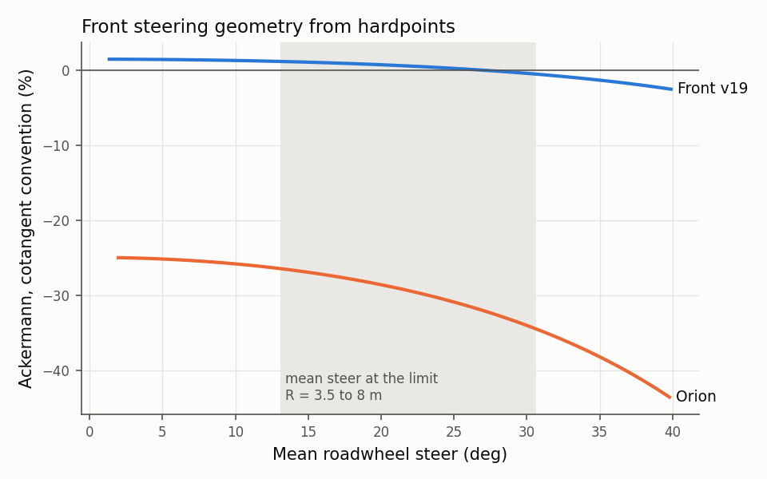
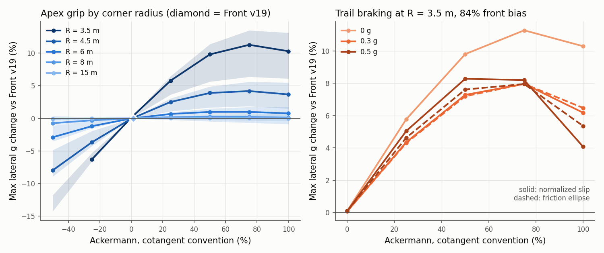

# front-ackermann

## Question

How much Ackermann should the 2027 Front v19 steering have? How much does
it change the car at the apex and under trail braking?

## Method

**Why not a lap-sim sweep.** The BobSim reduced model gives both front
wheels one steer angle. It builds the GGV at zero yaw rate, so both front
wheels see the same path angle. Its tire has no force peak. A lap-sim
sweep therefore cannot see Ackermann.

**Model.** `run.py` solves a quasi-steady corner at constant radius with
four wheels:

- Each wheel sees its own path angle (yaw rate × wheel position).
- Each tire uses the MF52 lateral force from the `.tir` file, through
  BobSim `_5_App/tire_eval.py`. The fit has a force peak, so a slip-angle
  mismatch between the two front tires costs grip.
- Load transfer comes from the body-frame acceleration, because the track
  and the wheelbase are fixed to the body. Lateral transfer
  `m·a_y·h` is split front to rear by LLTD. Longitudinal transfer is
  `m·a_x·h/L`. At 10° of body slip, part of the cornering acceleration
  acts along the body x axis.
- The script solves force balance and yaw balance for body slip and steer.
  A bisection on lateral g finds the limit.
- It keeps only stable states: each axle's lateral force must still rise
  with slip. This removes a drift state with 16° to 22° of rear slip.

**Trail braking.** A second sweep adds a constant braking deceleration:

- The total brake force is a third unknown, so the solve also balances
  the x axis.
- Brake force is split by the front bias and is equal left and right on
  each axle, because hydraulic pressure is equal on an axle.
- Each front wheel's brake force acts through its steer angle, in the
  force balance and in the yaw balance.
- Two combined-slip tire models bracket the result. The friction ellipse
  reduces lateral force by `√(1 − (Fx/Fx_max)²)`. The normalized-slip model
  builds combined slip from the pure MF52 curves, so a large slip angle
  also cuts braking capacity. Neither uses the fit's combined-slip
  coefficients, which have no documented source.
- A wheel that needs more brake force than it can give is locked. A locked
  state does not count.
- Yaw acceleration from the falling speed is left out. It is about 150 Nm
  at 0.5 g. With it, the ranking at 84% bias does not change.

**Geometry.** The Front v19 front-left hardpoints come from
`2027_FrontV19.shk`, `FRONT SUSPENSION` block (SHA-256 `361e76f3…e467ae02`).
Positive x points forward, and the origin is on the front axle centerline.
The rear SHK puts its wheel center at x = −1549.4 mm, which confirms the
frame. BobSim `kin_py` solves inner and outer roadwheel angle against rack
travel. `run.py` holds these points as constants and writes the changed
vehicle copy to `out/front-ackermann/vehicle_front_v19.yml`.

**Other inputs.** These are Orion carryovers from `vehicle/vehicle.yml`,
because the 2027 values are not known:

| Input | Value |
| ----- | ----- |
| Mass with driver | 261.1 kg |
| CG height | 0.280 m |
| Front static weight | 48.3% |
| LLTD, front | 52.0%, from BobSim nominal roll stiffness |
| Brake bias, front | 84% |
| Tire | `16x7p5_10_12psi`, LMUY = LMUX = 0.623 |
| Wheelbase, front track | 1.549 m, 1.245 m (Front v19) |

**Sweep.** The script compares the Front v19 curve with constant Ackermann
from −50% to +100% in 25% steps. The apex sweep runs at R = 3.5, 4.5, 6, 8
and 15 m (CG path radius). A 9 m outside-diameter hairpin puts the CG path
near 3.5 to 4 m.

| R | Front v19 roadwheel angle at the limit |
| - | -------------------------------------- |
| 3.5 m | 30° |
| 4.5 m | 22.5° |
| 6 m | 17° |
| 8 m | 13° |
| 15 m | 8° |

**Cases.**

- Apex: 12 cases per point. Tire stiffness scale LKY = 1 or 0.623; both
  tire slip signs, which cover left and right turns; LLTD front 32%, 52% or
  62%. At 32% the car is rear-limited in open corners, so this case stands
  in for a balanced car.
- Trail braking: R = 3.5 and 4.5 m; 0.3 and 0.5 g; front bias 84% and 70%.
  The ellipse runs at LKY 1 and 0.623 and LLTD 52% and 62%. The
  normalized-slip model runs at LKY 1 and LLTD 52%.
- The nominal case is LKY = 1, positive slip, and LLTD 52%.

**Outputs.**

- **Limiting axle.** The script adds 1% grip to one axle and reads the
  change in max lateral g.
- **Drag.** The drive force needed to hold speed at 80% of the Front v19
  limit.
- **Time.** The time for a 180° turn at radius R: arc time plus exit
  carry-over `Δv / a_x`, with a rear traction limit of `a_x` = 1.17 g.

Ackermann % uses the cotangent convention:
`100 · (cot δ_outer − cot δ_inner) · L / t`.

## Result



**Geometry.**

- Front v19 is parallel steer. Its Ackermann is +1.4%, +1.2% and +0.7% at
  10, 20 and 30 mm of rack. Orion is −26%, −29% and −35%.
- Front v19 steers slowly. To hold R = 3.5 m at the limit, it needs 30° at
  both wheels. That is 42 mm of rack travel, or 171° of handwheel at
  Orion's 88.9 mm/rev. Compare this with the real rack stops.
- The SHK gives Front v19 **−4.85° caster**. The upper ball joint is
  12.8 mm ahead of the lower one. Check this against CAD. With negative
  caster, the outer front wheel gains positive camber when steered. This
  study does not model camber.



**Apex grip.** The table gives the change in max lateral g compared with
Front v19. Each cell shows the nominal value, then the range over the
12 cases.

| R | +50% | +75% | +100% | Time per 180° turn, +75% |
| - | ---- | ---- | ----- | ------------------------ |
| 3.5 m | +9.8% (+5.6 to +11.4) | +11.3% (+6.4 to +13.5) | +10.3% (+6.1 to +13.1) | −121 ms (−69 to −145) |
| 4.5 m | +3.9% (+1.7 to +4.9) | +4.2% (+1.9 to +5.6) | +3.7% (+1.5 to +5.5) | −52 ms (−23 to −69) |
| 6 m | +1.0% (−0.5 to +1.5) | +1.0% (−0.7 to +1.7) | +0.8% (−0.9 to +1.7) | −14 ms (+10 to −25) |
| 8 m | +0.2% (−0.2 to +0.5) | +0.2% (−0.3 to +0.6) | +0.1% (−0.4 to +0.6) | −3 ms (+6 to −10) |
| 15 m | 0.0% (0.0 to +0.1) | 0.0% (−0.1 to +0.2) | 0.0% (−0.1 to +0.2) | 0 ms (+1 to −4) |

- +75% gives the most grip at 3.5 m in 11 of 12 cases, and at 4.5 m in 9
  of 12. +50% to +100% is a plateau.
- At 8 m and 15 m every setting from 0% to +100% is within 0.6%. Open
  corners do not choose the Ackermann.
- Negative Ackermann loses grip. At 3.5 m, −50% gives −11.8% to −14.3%.
- The Front v19 limit is 1.09 to 1.24 g at 3.5 m and 1.28 to 1.40 g at
  15 m.

**Balance.**

- At LLTD 52% and 62%, every case at 3.5 m and 4.5 m is front-limited.
  1% more front grip gives +0.7% to +0.9% max lateral g. 1% more rear
  grip gives nothing.
- At LLTD 32%, Front v19 is still front-limited at 3.5 m. +75% then makes
  the car rear-limited there, with +8.9%. Ackermann moves the tight-corner
  balance until the rear is the limit.
- LLTD sets the balance in open corners. Ackermann sets it in tight
  corners, where the front loses grip to toe mismatch, not to load
  transfer.

**Trail braking at 84% bias.** The table gives the change in max lateral
g compared with Front v19 at the same braking. Each cell shows the
normalized-slip result, then the ellipse result.

| R, braking | +50% | +75% | +100% |
| ---------- | ---- | ---- | ----- |
| 3.5 m, 0.3 g | +7.3 / +7.2% | +8.0 / +8.0% | +6.2 / +6.5% |
| 3.5 m, 0.5 g | +8.3 / +7.6% | +8.2 / +8.0% | +4.1 / +5.4% |
| 4.5 m, 0.3 g | +3.0 / +3.0% | +3.1 / +3.7% | +2.2 / +2.5% |
| 4.5 m, 0.5 g | +2.9 / +3.0% | +1.9 / +2.7% | −0.6 / +1.4% |

- The grip probe shows every ellipse case at 84% bias is front-limited, so
  the ranking is valid. An independent probe of the normalized-slip model
  at 3.5 m and 0.5 g agrees.
- Braking moves the best setting down. At 0.5 g, +50% and +75% are within
  0.4% at 3.5 m, and +50% is best at 4.5 m. +100% falls behind, because
  the light inner front runs a large slip angle and a large brake force at
  the same time.
- The inner front uses at most 71% of its braking capacity at the limit.
  Lock does not set the limit at 0.5 g or less.

**Trail braking at 70% bias.** The rear takes 30% of the brake force on a
light inner rear wheel. Many cases become rear-limited. There, more
Ackermann does not help: at 4.5 m and 0.5 g, +50% gives −1.5%. This is a
brake-bias trade, not a steering result. The 70% bias also raises the
Front v19 limit at 3.5 m and 0.5 g from 1.09 to 1.17 g.

**Recommendation.** Aim for about +50% at hairpin steer (20° to 30°
roadwheel). It is within 1.5% of the best apex result, best or tied under
trail braking, and needs less linkage change than +75%. Avoid +100%.

**Drag.** At 80% of the limit and R = 3.5 m, the drive force to hold speed
is 258 to 306 N for Front v19, 125 to 198 N for +50% and 84 to 173 N for
+75%. At 8 m, Front v19 and +50% are within 6 N.

**How to get more Ackermann.** Moving the tie rod outer point 32 mm
outboard gives +50% (48.6%, 50.0% and 52.6% at 10, 20 and 30 mm of rack).
This has three costs:

- It puts the point 19 mm inboard of the wheel center plane. Check the
  packaging in CAD.
- It adds bump steer: −0.18° and +0.21° of toe at −25 mm and +25 mm of
  jounce. The rack pickup must move to remove it.
- The rack position and the rack length are the other levers. This study
  did not map them.

**Across events.**

- Acceleration: no effect.
- Skidpad (R = 9.125 m): between the 8 m and 15 m results, so no effect.
- Autocross and endurance: multiply the time per tight corner by the number
  of corners under about 6 m on the course. That takes one baseline lap,
  not a lap-sim sweep.

**Confidence.** The limits are in the scope and the inputs, not in the
math.

- **Math.** Solves converge to a residual under 1e-7. The gain falls about
  as 1/R⁴, as mismatch² predicts. An independent implementation matches
  the braking results to 0.001 g. The Orion geometry matches independent
  numbers.
- **Scope.** The model is quasi-steady. It has no throttle on exit, no
  trail-brake rotation beyond the steady state, no camber or steer camber,
  no compliance steer and no aligning moment. Rotation from throttle moves
  the turn center forward and lowers the Ackermann need, so treat the
  apex gain as an upper bound. The 180° times assume the whole turn is at
  radius R.
- **Inputs.** The tire is a raw TTC fit with an unvalidated 0.623 grip
  scale. The gain changes by up to 2× across the tire cases. Mass, CG,
  LLTD and brake bias are Orion carryovers.
- **What holds in every case:** pro-Ackermann beats Front v19 in tight
  corners, open corners do not care, and +100% loses under braking.

## Provenance

Front v19 steering hardpoints on the Orion vehicle.

```json
PROVENANCE
```
