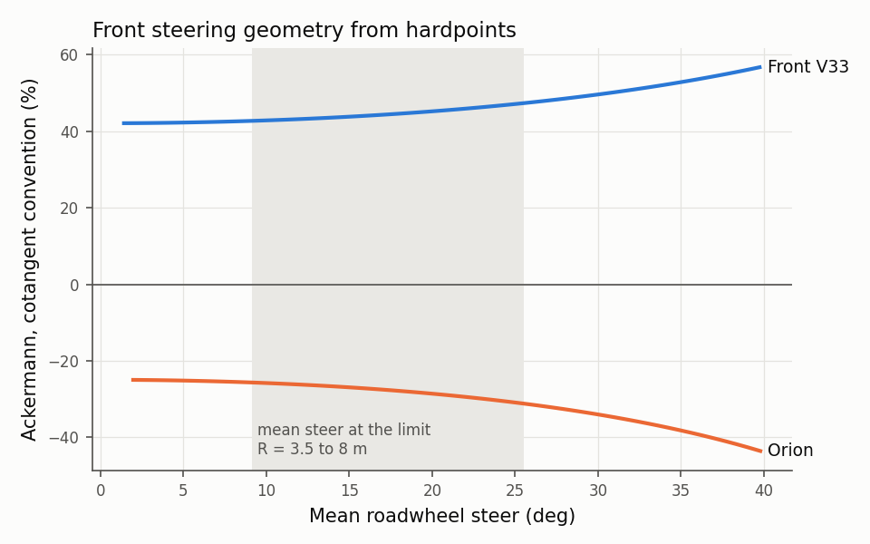
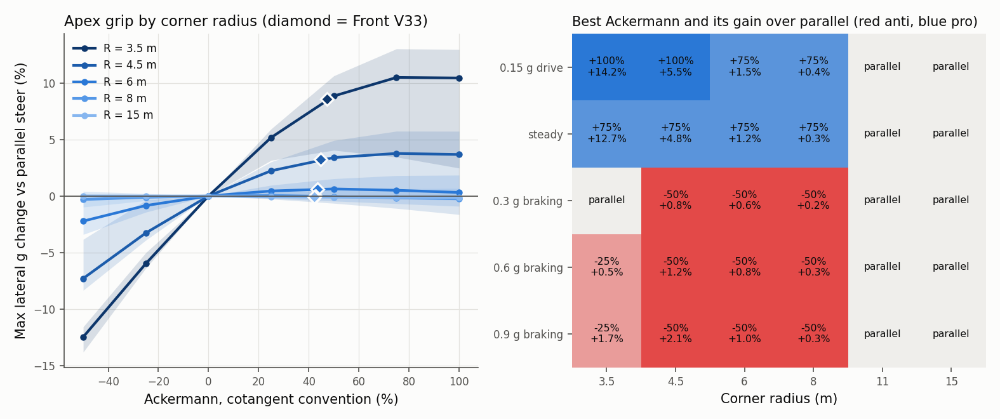

# front-ackermann

## Question

Can the 2027 Front v20 steering reach the tightest hairpin, and how much
Ackermann should it have? How does that change at the apex, under trail
braking and under throttle?

**This is a screening study.** The steering geometry is Front v20. Mass,
CG, weight split, rack travel, diff direction and "balanced car" are team
estimates for 2027 (2026-09-26). The brake bias is a first-principles
estimate. The tire, rear geometry, static toe and compliance are still
Orion carryovers or unknown, and the study varies them. It gives the
direction and the sensitivities. See
[Check before design freeze](#check-before-design-freeze).

## Method

**Why not a lap-sim sweep.** The BobSim reduced model gives both front
wheels one steer angle. It builds the GGV at zero yaw rate, so both front
wheels see the same path angle. Its tire has no force peak. A lap-sim
sweep therefore cannot see Ackermann.

**Model.** `run.py` solves a quasi-steady corner at constant radius with
four wheels:

- Each wheel sees its own path angle (yaw rate × wheel position).
- Each tire uses the MF52 lateral force from the `.tir` file, through
  BobSim `_5_App/tire_eval.py`. The fit has a force peak, so a slip-angle
  mismatch between the two front tires costs grip.
- Load transfer comes from the body-frame acceleration, because the track
  and the wheelbase are fixed to the body. Lateral transfer `m·a_y·h` is
  split front to rear by LLTD. Longitudinal transfer is `m·a_x·h/L`.
- The script solves force balance and yaw balance for body slip and steer.
  A bisection on lateral g finds the limit.
- It keeps only stable states: each axle's lateral force must still rise
  with slip.

**Balanced car.** The nominal LLTD is the one that gives the most lateral
g at R = 15 m, where both axles saturate together. Ackermann has almost no
effect at 15 m, so LLTD alone sets the balance there. The result is
<!-- out:readme.json#lltd_front_pct|.1f -->34.2<!-- /out -->% front. The study also runs ±10 points.

**Longitudinal cases.** A constant tangential acceleration is added. The
total longitudinal force is a third unknown, so the solve also balances
the x axis. Each front wheel's force acts through its steer angle.

- **Trail braking.** Brake force is split by the front bias and is equal
  left and right on each axle (equal hydraulic pressure).
- **Regen through the diff.** The rear share of braking goes through the
  diff, with its coast lock.
- **Throttle.** Drive force goes to the rear through the diff. The LSD uses
  the BobLib `Differential1D` law: the left/right torque difference is
  `0.85 · (2 · T_preload + λ · |T|)`, and it goes to the slower inner
  wheel.
- Three diffs: open, the Orion tune (20 Nm, 0.35 drive, 0.15 coast) and
  the planned Drexler direction (5 Nm, 0.60 drive, 0.35 coast). The planned
  values are illustrative: minimal preload and a 30°/45° ramp pair, where
  a lower ramp angle gives more lock.
- A wheel that needs more longitudinal force than it can give is locked or
  spinning. That state does not count. Limits set by wheelspin are flagged.
- Under braking, two combined-slip tire models bracket the result: the
  friction ellipse and a normalized-slip model built from the pure MF52
  curves. The throttle, regen, toe and mass cases use the friction ellipse.

**Steering lock and linkage.** BobSim `kin_py` solves inner and outer
roadwheel angle against rack travel from the Front v20 hardpoints. The
source is the team hardpoint sheet ("Solidworks HDPT Input", column "new
front v20", 2026-09-24). `run.py` holds the points in inches and writes
the assembled vehicle to `out/front-ackermann/vehicle_front_v20.yml`.

- The sheet gives x without a sign. The signs follow Front v19
  (`2027_FrontV19.shk`), which has the same x magnitudes.
- The sheet has no wheel center. The study keeps the v19 wheel center.
- Compared with v19, v20 raises the lower inboard pickups by 24.2 mm and
  the upper inboard pickups by 39.6 mm. It moves the rack pickup 22.8 mm
  forward and 33.1 mm up. The outboard points and the tie rod outer point
  do not change.

The script also solves new tie rod outer points and rack pickups that
reach the hairpin steer at 90% of rack travel, with a target Ackermann and
zero bump steer.

**Inputs.**

| Input | Value | Source | Varied |
| ----- | ----- | ------ | ------ |
| Mass with driver | 263.1 kg (430 + 150 lb) | team 2027 estimate | ±10 kg |
| CG height | 0.279 m (11 in) | team 2027 estimate | ±20 mm |
| Front static weight | 45% | team 2027 estimate | ±3 points |
| LLTD, front | <!-- out:readme.json#lltd_front_pct|.1f -->34.2<!-- /out -->% | balanced at 15 m | ±10 points |
| Rack travel | 31.75 mm (1.25 in) each way | team | – |
| Static camber | 0° in the model | team default is −1° | −1° |
| Static toe | 0° | team default | 1.0° in to 1.0° out |
| Diff | see above | team direction | three diffs |
| Brake bias, front | 65% | first principles, see below | 84%; regen |
| Tire | `16x7p5_10_12psi`, LMUY = LMUX = 0.623 | Orion carryover | LKY 1, 0.623 |
| Rear geometry, wheelbase, tracks | 1.549 m, 1.245 / 1.212 m | Front v20, Orion rear | – |

Static camber stays 0° in the model because the tire fit has no camber
thrust (PHY3 = PVY3 = PVY4 = 0). The study still runs −1° as a
sensitivity.

**Sweep.** The Front v20 curve is compared with constant Ackermann from
−50% to +100% in 25% steps, and in 10% steps for the toe cases. The apex
runs at R = 3.5, 4.5, 6, 8 and 15 m (CG path radius). A 9 m
outside-diameter hairpin puts the tightest legal CG path near 3.5 to
3.7 m.

Ackermann % uses the cotangent convention:
`100 · (cot δ_outer − cot δ_inner) · L / t`.

## Result

`make study` fills in the numbers between `out:` markers from the last run.



**Steering lock (read this first).**

- Front v20 has <!-- out:readme.json#v20_ackermann_pct -->−6.3% to −7.8%<!-- /out --> Ackermann, so it is slightly
  anti. At 31.75 mm of rack it steers <!-- out:readme.json#steer_at_travel_deg|.1f -->22.4<!-- /out -->°.
- At the grip limit the car needs <!-- out:readme.json#steer_needed_3p5_deg|.1f -->29.7<!-- /out -->° of mean
  steer at R = 3.5 m and <!-- out:readme.json#steer_needed_4p5_deg|.1f -->21.2<!-- /out -->° at 4.5 m. Its
  tightest CG radius at the limit is <!-- out:readme.json#tightest_radius_m|.1f -->4.3<!-- /out --> m.
- At walking speed the rear axle center turns on
  <!-- out:readme.json#rear_axle_walking_m|.2f -->3.75<!-- /out --> m and the outer front wheel center on
  <!-- out:readme.json#outer_wheel_walking_m|.2f -->4.01<!-- /out --> m, against a 4.5 m outside boundary.
- So with 1.25 in of rack, Front v20 cannot hold a minimum hairpin at the
  grip limit. It must slow below the limit in every tight hairpin. This
  costs more than any Ackermann choice.
- The cause is the long steering arm: the tie rod outer point is
  <!-- out:readme.json#arm_offset_mm|.0f -->82<!-- /out --> mm from the kingpin axis. Holding R = 3.5 m
  with this arm needs <!-- out:readme.json#rack_needed_mm|.1f -->41.2<!-- /out --> mm of rack.

**Linkage options.** Each option reaches its own hairpin steer demand at
90% of rack travel (<!-- out:readme.json#fix_rack_mm|.1f -->28.6<!-- /out --> mm), which leaves 10% for
driver corrections. The rack pickup moves to keep bump steer at zero at
center (tie rod aligned with the wishbones' instant center).

<!-- out:linkage.md -->

| Option | Tie rod outer move | To wheel center plane | Arm to kingpin | Rack pickup move | Toggle margin at inner lock | Bump toe at inner lock, ±25 mm |
| ------ | ------------------ | --------------------- | -------------- | ---------------- | --------------------------- | ------------------------------ |
| Front v20 | – | 51 mm | 82 mm | – | 70° | +0.2° / −0.3° |
| 0% | 24 mm rearward, 9 mm outboard | 42 mm | 58 mm | 5 mm outboard, 1 mm down | 58° | +0.4° / −0.5° |
| +50% | 16 mm rearward, 33 mm outboard | 18 mm | 71 mm | 14 mm outboard, 2 mm down | 41° | +0.5° / −0.6° |
| +70% | 13 mm rearward, 46 mm outboard | 6 mm | 80 mm | 19 mm outboard, 2 mm down | 34° | +0.5° / −0.7° |

<!-- /out -->

- Pro-Ackermann needs less mean steer, because the outer wheel steers
  less: <!-- out:readme.json#steer_50_deg|.1f -->25.3<!-- /out -->° for +50% against <!-- out:readme.json#steer_0_deg|.1f -->28.9<!-- /out -->°
  for parallel.
- With a front rack, Ackermann moves the tie rod point outboard, toward
  the wheel. +70% is likely not buildable. +50% needs a CAD check.
- The other levers are more rack travel and moving the rack behind the
  axle. This study did not map them.



**Apex.** Change in max lateral g compared with Front v20. Each cell shows
the nominal value, then the range over 12 cases (two tire stiffness
scales, both slip signs, three LLTDs). This assumes the steering can reach
the angle.

<!-- out:apex.md -->

| R | +50% | +75% | +100% | Time per 180° turn, +75% |
| - | ---- | ---- | ----- | ------------------------ |
| 3.5 m | +11.0% (+5.7 to +13.2) | +12.6% (+5.1 to +15.5) | +12.6% (+4.1 to +15.4) | −132 ms (−162 to −55) |
| 4.5 m | +4.1% (−0.7 to +5.9) | +4.5% (−1.1 to +6.7) | +4.4% (−1.6 to +6.7) | −54 ms (−81 to +14) |
| 6 m | +0.7% (−0.5 to +1.8) | +0.8% (−0.7 to +2.0) | +0.4% (−0.9 to +2.1) | −11 ms (−29 to +10) |
| 8 m | −0.1% (−0.2 to +0.6) | −0.2% (−0.3 to +0.7) | −0.3% (−0.4 to +0.7) | +3 ms (−11 to +5) |
| 15 m | 0.0% (−0.1 to +0.1) | 0.0% (−0.1 to +0.2) | −0.2% (−0.2 to +0.2) | 0 ms (−4 to +1) |

<!-- /out -->

- Front v20 is front-limited up to <!-- out:readme.json#front_limited_to_m -->6 m<!-- /out -->. More
  Ackermann moves the car to rear-limited.
- Once the rear limits, more Ackermann stops paying. In open corners
  (8 m and up), pro-Ackermann costs up to <!-- out:readme.json#open_corner_cost_pct|.1f -->0.3<!-- /out -->%.

**First-principles check.** The front axle wants the toe difference
`Δθ + α_in − α_out`. Δθ is the difference between the two front wheels'
path angles, which rear slip makes smaller than the no-slip `L·t/R²`. Each
α is the slip angle that maximizes that tire's force weighted by its yaw
lever, `L·cos δ ± (t/2)·sin δ`. For a front-limited car this gives the
optimum:

<!-- out:optimum.md -->

| R | Front-limited optimum | Solver optimum (10% steps) | +75% limited by |
| - | --------------------- | -------------------------- | --------------- |
| 3.5 m | 87% | +90% | front |
| 4.5 m | 85% | +80% | rear |

<!-- /out -->

Where the front limits, the two agree. Where the rear limits first, the
car takes less Ackermann than the front wants.

**Brake bias.** `vehicle.yml` has 84% front. No test or calculation backs
it. It came from a BobSim GGV default. Ideal bias puts the same fraction
of each axle's grip into braking. With a load-independent μ that is the
front load share at the limit, `W_f/W + (h/L)·a_x`. With the load-sensitive
tire, the straight-line limit is highest at <!-- out:readme.json#ideal_bias_pct|.0f -->68<!-- /out -->%
front (<!-- out:readme.json#ideal_limit_g|.2f -->1.54<!-- /out --> g).

<!-- out:bias.md -->

| Front bias | Locks first | Straight-line limit |
| ---------- | ----------- | ------------------- |
| 65% | rear | 1.46 g |
| 84% | front | 1.18 g |

<!-- /out -->

The study uses 65% as nominal and keeps 84% as a sensitivity. At 65% the
rear locks first in a straight line. Many cars run a few points forward of
ideal so the front locks first. That is a stability choice, not a grip
choice.

**Trail braking at 65% bias.** Change compared with Front v20 at the same
braking, normalized-slip / ellipse tire. The two tire models differ by at
most <!-- out:readme.json#brake_model_gap_pts|.1f -->0.6<!-- /out --> points.

<!-- out:braking.md -->

| R, braking | +25% | +50% | +75% | +100% |
| ---------- | ---- | ---- | ---- | ----- |
| 3.5 m, 0.3 g | −0.4 / −0.3% | −1.0 / −1.0% | −2.1 / −2.0% | −3.5 / −3.4% |
| 3.5 m, 0.5 g | −0.9 / −0.6% | −1.8 / −1.4% | −3.1 / −2.7% | −4.7 / −4.2% |
| 4.5 m, 0.3 g | −0.7 / −0.7% | −1.4 / −1.3% | −2.1 / −2.0% | −2.8 / −2.7% |
| 4.5 m, 0.5 g | −0.9 / −0.9% | −1.8 / −1.6% | −2.6 / −2.5% | −3.5 / −3.3% |

<!-- /out -->

- Braking puts load on the front and takes it off the rear. The rear still
  carries 35% of the brake force, so the rear limits under trail braking.
  More Ackermann then costs grip.
- At 84% bias, the front brakes harder. At 3.5 m and 0.5 g the front then
  limits, and +25% to +50% gain <!-- out:readme.json#bias_sensitivity_gain -->+8.3 to +9.4%<!-- /out -->. The other
  84% cases lose, as at 65%.

**Throttle.** Change compared with Front v20 at the same drive, ellipse
tire. Each cell is +50% / +75% / +100%. "Spin" means a rear wheel sets the
limit.

<!-- out:throttle.md -->

| R, drive | Open diff | Orion LSD | Planned LSD |
| -------- | --------- | --------- | ----------- |
| 3.5 m, 0 g | +9.9 / +10.0 / +9.4% | +13.2 / +15.2 / +15.0% | +13.4 / +15.4 / +15.2% |
| 4.5 m, 0 g | +1.6 / +1.4 / +1.1% | +5.3 / +5.9 / +5.7% | +5.2 / +5.7 / +5.5% |
| 3.5 m, 0.2 g | +11.7 / +12.6 / +12.6% | spin | spin |
| 4.5 m, 0.2 g | +3.5 / +3.6 / +3.5% | spin | spin |

<!-- /out -->

- The LSD's locking torque goes to the slower inner rear, which is an
  understeer moment. The car becomes front-limited, and Ackermann is worth
  more. The planned high drive lock makes this stronger than the Orion
  tune.
- At 0.2 g with an LSD, a rear wheel spins. Those points say nothing
  about Ackermann. At 0.4 g, a rear wheel spins with every diff, so the
  study does not run 0.4 g.

**Regen through the diff.** The front share of braking is 65% (the
nominal bias) or 55% (more regen on the rear, the BobLib
`BasicVCUBrakes` default). Each cell is the +50% change, the best
Ackermann and the axle that limits Front v20.

<!-- out:regen.md -->

| Diff, front share, braking | 3.5 m | 4.5 m |
| -------------------------- | ----- | ----- |
| orion, 65%, 0.3 g | +6.9%, best +25%, front-limited | −0.9%, best +0%, rear-limited |
| orion, 65%, 0.5 g | +7.8%, best +25%, front-limited | −1.2%, best +0%, rear-limited |
| orion, 55%, 0.3 g | +5.8%, best +25%, front-limited | −1.0%, best +0%, rear-limited |
| orion, 55%, 0.5 g | +2.4%, best +0%, front-limited | −1.5%, best +0%, rear-limited |
| planned, 65%, 0.3 g | +1.4%, best +0%, front-limited | −1.1%, best +0%, rear-limited |
| planned, 65%, 0.5 g | +3.2%, best +0%, front-limited | −1.3%, best +0%, rear-limited |
| planned, 55%, 0.3 g | −0.5%, best +0%, front-limited | −1.1%, best +0%, rear-limited |
| planned, 55%, 0.5 g | −1.1%, best +0%, rear-limited | −1.5%, best +0%, rear-limited |

<!-- /out -->

A front-limited hairpin can still gain from Ackermann under regen. A
higher coast lock or more regen on the rear moves the car toward the rear
limit, and then Ackermann costs grip.

**Static toe.** Best Ackermann in 10% steps. The best gain is the same at
every toe, so toe replaces Ackermann and does not add grip.

<!-- out:toe.md -->

| Total toe-out | 3.5 m best | 4.5 m best |
| ------------- | ---------- | ---------- |
| −1.0° (toe-in) | +100% | +100% |
| −0.5° | +90% | +90% |
| 0.0° | +90% | +80% |
| +0.5° | +80% | +70% |
| +1.0° | +70% | +60% |

<!-- /out -->

1° of toe-out replaces about <!-- out:readme.json#points_per_deg_toe_3p5|.0f -->10<!-- /out --> Ackermann
points at 3.5 m and about <!-- out:readme.json#points_per_deg_toe_4p5|.0f -->18<!-- /out --> at 4.5 m.
Toe-out also costs straight-line scrub, tire heat and darting, which are
not in this model.

**Mass, CG and camber.** Mass ±10 kg, CG ±20 mm, front weight ±3 points
and −1° camber change the gains by at most <!-- out:readme.json#mass_gap_pts|.1f -->0.4<!-- /out -->
points.

**Michigan 2019 endurance.** BobSim's minimum-curvature line depends only
on the track. It is <!-- out:readme.json#track_length_m|.0f -->1989<!-- /out --> m long, with
<!-- out:readme.json#corners_under_15m -->42<!-- /out --> corners under 15 m, <!-- out:readme.json#corners_under_6m -->8<!-- /out --> under
6 m, and a tightest radius of <!-- out:readme.json#tightest_corner_m|.1f -->4.5<!-- /out --> m. For each
corner the script adds arc time at its minimum radius, plus the speed
carried onto the next straight and into the braking zone. The low value
uses a <!-- out:readme.json#exit_g|.2f -->1.22<!-- /out --> g exit and a <!-- out:readme.json#entry_g|.2f -->1.46<!-- /out --> g entry, the
straight-line limit at 65% bias. The high value uses 0.4 g and 0.5 g.

<!-- out:lap.md -->

| Linkage | Time saved per lap vs Front v20 |
| ------- | ------------------------------- |
| +50% | 0.27 to 0.54 s |
| +75% | 0.27 to 0.52 s |
| +100% | 0.20 to 0.36 s |

<!-- /out -->

This is an estimate. It uses the apex results only, and it assumes the
steering can reach every corner.

**Screening result.**

1. **Fix the steering lock first.** With 1.25 in of rack, Front v20 cannot
   hold a minimum hairpin at the limit. Get more rack travel, or a
   shorter steering arm (tie rod point about 58 to 71 mm from the kingpin
   axis).
2. **Aim for about +50% Ackermann at hairpin steer, measured with 0°
   static toe.** Per lap, +50% and +75% tie. The apex alone favors +75% to
   +90% at 3.5 m. +50% loses about half as much grip under trail braking,
   and it keeps the tie rod point clear of the wheel. Avoid +100%.
3. **Set Ackermann and static toe together.** If packaging allows less
   than +50%, 1° of toe-out makes up about 10 to 20 points, at a
   straight-line cost.
4. **The diff tune moves the answer.** A high drive lock makes more
   Ackermann worth more on exit. A high coast lock makes it worth less
   under regen.

**Drag.** At 80% of the limit and R = 3.5 m, the drive force to hold speed
is <!-- out:readme.json#drag_v20_n|.0f -->277<!-- /out --> N for Front v20, <!-- out:readme.json#drag_50_n|.0f -->141<!-- /out --> N for
+50% and <!-- out:readme.json#drag_75_n|.0f -->105<!-- /out --> N for +75%. Less front slip mismatch means
less tire drag. At 8 m the difference is <!-- out:readme.json#drag_8m_gap_n|.0f -->7<!-- /out --> N.

**Across events.**

- Acceleration: no effect.
- Skidpad (R = 9.125 m): between the 8 m and 15 m results, so within
  <!-- out:readme.json#skidpad_pct|.1f -->0.7<!-- /out -->%.
- Autocross: use the Michigan method on the autocross course.

**Confidence.** The limits are in the scope and the inputs, not in the
math.

- **Math.** Solves converge to a residual under 1e-7. The closed-form
  front optimum matches the solver where the front limits. An independent
  implementation matched the braking, throttle and toe results to
  0.001 g on the Front v19 inputs.
- **Scope.** The model is quasi-steady. It cannot show power-on or
  trail-brake rotation beyond the steady state. It has no steer camber,
  compliance steer, aligning moment or yaw acceleration. The lap estimate
  puts each corner at its minimum radius.
- **Inputs.** The tire is a raw TTC fit with an unvalidated 0.623 grip
  scale. The +75% gain at 3.5 m goes from <!-- out:readme.json#gain_75_3p5 -->+5.1 to +15.5%<!-- /out --> across the
  cases. The balanced-car LLTD, the 65% brake bias and the planned diff
  values are assumptions.
- **What holds in every case:** Front v20 with 1.25 in of rack cannot hold
  a minimum hairpin at the limit, open corners gain nothing, and toe
  trades one-for-one with Ackermann.

## Check before design freeze

1. **Geometry.** Confirm the x signs and the wheel center for v20, and
   check the −4.85° caster.
2. **Steering lock.** Pick more rack travel or a shorter steering arm.
   Check tire, wheel and body clearance at full lock, and the toggle margin
   of the inner wheel.
3. **Static toe and compliance.** Set the static toe together with the
   Ackermann. Measure toe change under load.
4. **Tie rod and rack packaging.** Check the chosen tie rod outer point
   against the wheel and brake in CAD, and move the rack pickup to keep
   bump steer at zero.
5. **Brake bias and regen.** Get the 2027 hydraulic bias (the study
   assumes 65%) and the regen torque commanded under braking.
6. **Diff tune.** Get the Drexler ramp angles, plate count and preload.
7. **Tire.** Validate the grip scale on track.

Rerun the study when these are known.

## Provenance

Front v20 steering hardpoints, team 2027 mass and CG, balanced LLTD, Orion
rear and tire.

<!-- out:provenance.json -->

```json
{
  "study": "front-ackermann",
  "bobsim_sha": "4da577af1b04d86c53706eb6e80fb0064f71cee6",
  "vehicle_sha256": "3ab02bbf3e573aad0330bc37ce40fd254090d33dabd3760462c51da74e30afe8",
  "utc": "2026-09-29T02:37:11+00:00"
}
```

<!-- /out -->
